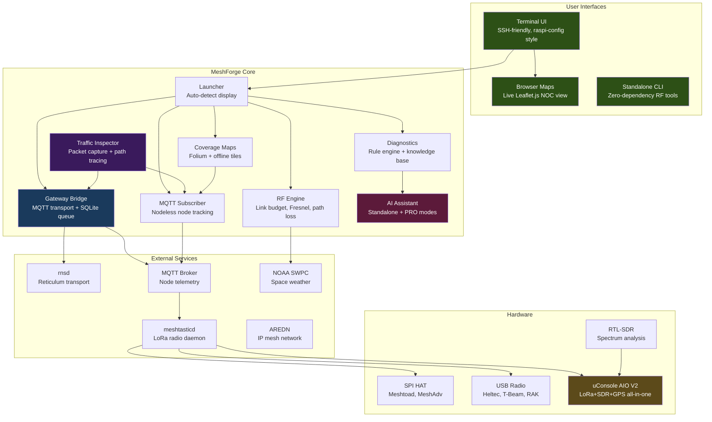
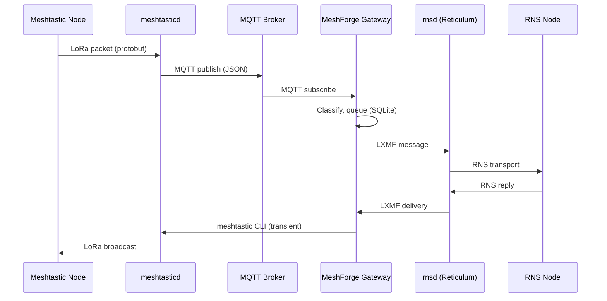

# MeshForge

<p align="center">
  
</p>

<p align="center">
  <strong>Mesh Network Operations Center & Development Ecosystem</strong><br>
  <em>Meshtastic + Reticulum + MeshCore + AREDN — Build. Test. Deploy. Monitor.</em>
</p>

<p align="center">
  <a href="https://github.com/Nursedude/meshforge"></a>
  <a href="LICENSE"></a>
  <a href="https://python.org"></a>
  <a href="https://github.com/Nursedude/meshforge/actions"></a>
</p>

<p align="center">
  <a href="https://nursedude.substack.com">Development Blog</a> |
  <a href="https://github.com/Nursedude/meshforge/issues">Report Issues</a> |
  <a href="#contributing">Contribute</a>
</p>

---

## What is MeshForge?

**MeshForge turns a Raspberry Pi into a mesh network operations center and development platform.**

Plug in a LoRa radio, run the installer, and you get:
- A **gateway** bridging Meshtastic and Reticulum via MQTT (zero interference)
- **Live NOC maps** showing Meshtastic AND RNS nodes on one map
- **Coverage maps** with SNR-based link quality
- **Wireshark-grade packet inspection** for both networks
- **RF engineering tools** for site planning
- **meshtastic CLI** integration for radio config (transient, no interference)
- **AI diagnostics** that work offline

### The Vision

Modern mesh networks are fragmented. Meshtastic nodes can't talk to Reticulum nodes. AREDN operates on a different layer entirely. Each ecosystem has its own tools, its own interfaces, its own learning curve.

**MeshForge unifies them.**

One interface to monitor Meshtastic, Reticulum, and AREDN. One gateway to bridge messages between incompatible meshes. One toolkit for RF planning, diagnostics, and field operations. All running on a $35 Raspberry Pi that you can SSH into from anywhere.

This is the first open-source tool to bridge Meshtastic (LoRa mesh) with Reticulum (encrypted transport layer). No cloud dependencies. No subscriptions. Just a box that makes mesh networks work together.

```bash
sudo python3 src/launcher_tui/main.py
```

**Built for:** HAM operators, emergency comms teams, off-grid builders, preppers, and mesh enthusiasts who want professional-grade network visibility without the complexity.

---

## Quick Start

> **Already running MeshForge?** See [Upgrading](#upgrading-meshforge) for upgrade paths.

### Fresh Install

```bash
git clone https://github.com/Nursedude/meshforge.git
cd meshforge
sudo bash scripts/install_noc.sh    # Full NOC stack install
```

The installer auto-detects your radio hardware (SPI HAT or USB), installs
meshtasticd + Reticulum, and sets up systemd services. It will prompt you
to select your HAT if SPI is detected.

**Installer options:**
```bash
sudo bash scripts/install_noc.sh --skip-meshtasticd   # Don't install meshtasticd
sudo bash scripts/install_noc.sh --skip-rns            # Don't install Reticulum
sudo bash scripts/install_noc.sh --client-only         # MeshForge only (no daemons)
sudo bash scripts/install_noc.sh --force-native        # Force SPI mode
sudo bash scripts/install_noc.sh --force-python        # Force USB mode
```

### Alpha Install (MeshCore Integration)

To install the alpha version with MeshCore support (3-way routing between
Meshtastic, Reticulum, and MeshCore networks):

```bash
git clone https://github.com/Nursedude/meshforge.git
cd meshforge
git checkout alpha/meshcore-bridge
sudo bash scripts/install_noc.sh
```

The alpha branch (`0.6.0-alpha`) includes:
- **MeshCore handler** — companion radio detection and management
- **3-way message routing** — Meshtastic ↔ RNS ↔ MeshCore bridge
- **Canonical message format** — unified multi-protocol message representation
- **MeshCore TUI menu** — device management from the terminal interface

> **Note:** The `main` and `alpha/meshcore-bridge` branches have diverged into
> parallel development tracks (~2,200 commits ahead, ~100 behind as of Feb 2026).
> Main includes tactical ops (XTOC/ATAK interop), MQTT bridge enhancements, and
> security hardening that alpha does not have. Alpha includes MeshCore 3-way routing
> that main does not have. Convergence will require a dedicated reconciliation effort.
> Report issues on the [alpha/meshcore-bridge](https://github.com/Nursedude/meshforge/issues) tracker.

### Deployment Profiles

MeshForge supports 5 deployment profiles. Install only the dependencies you need:

| Profile | Services Needed | Install | Use Case |
|---------|----------------|---------|----------|
| `radio_maps` | meshtasticd | `pip install -r requirements/core.txt -r requirements/maps.txt` | Radio config + coverage maps |
| `monitor` | (none) | `pip install -r requirements/core.txt -r requirements/mqtt.txt` | MQTT packet analysis |
| `meshcore` | (none) | `pip install -r requirements/core.txt` + meshcore | MeshCore companion radio |
| `gateway` | meshtasticd, rnsd | `pip install -r requirements/core.txt -r requirements/rns.txt -r requirements/mqtt.txt` | Meshtastic <> RNS bridge |
| `full` | meshtasticd, rnsd, mosquitto | `pip install -r requirements.txt` | Everything |

```bash
# Select profile at launch
python3 src/launcher.py --profile gateway

# Auto-detect (default): scans running services and installed packages
python3 src/launcher.py

# Profile is saved to ~/.config/meshforge/deployment.json
```

### Already Have meshtasticd?

```bash
sudo python3 src/launcher_tui/main.py
```

### RF Tools Only (no sudo, no radio)

```bash
python3 src/standalone.py
```

### Upgrade / Reinstall

Already running MeshForge? Pick your path:

```bash
# Option 1: Clean reinstall (recommended)
# Backs up configs → removes code → fresh clone → restores configs
# Your radio, RNS identity, and MQTT broker are NOT touched
sudo bash /opt/meshforge/scripts/reinstall.sh

# Option 2: Quick update (code + service files)
cd /opt/meshforge && sudo bash scripts/update.sh

# Option 3: Manual git pull (developers)
cd /opt/meshforge && sudo git pull origin main
```

After any upgrade, verify:
```bash
sudo bash scripts/install_noc.sh --verify-install
```

### TUI Menu Structure

The TUI uses a raspi-config style interface (whiptail/dialog) designed for SSH and
headless operation. Navigation is keyboard-driven with max 10 items per menu level:

```
Main Menu (MeshForge NOC)
├── 1. Dashboard             Service status, health, alerts, data path check
├── 2. Mesh Networks         Meshtastic, RNS, MeshCore, AREDN, MQTT, Gateway
├── 3. RF & SDR              Link budget, site planner, frequency slots, SDR
├── 4. Maps & Viz            Live NOC map, coverage, topology, traffic inspector
├── 5. Configuration         Radio, channels, RNS config, services, backup
├── 6. System                Hardware detect, logs, network tools, shell, reboot
├── q. Quick Actions         Common shortcuts (2-tap access)
├── e. Emergency Mode        Field ops, weather/EAS alerts, SOS beacon
├── a. About                 Version, web client, help
└── x. Exit
```

**Design principles** (inspired by
[raspi-config](https://www.raspberrypi.com/documentation/computers/configuration.html)):
- Max 10 items per menu (cognitive load limit)
- Grouped by user task, not technical domain
- 2-tap max for common operations via Quick Actions
- Startup checks detect conflicts, verify services, warn on misconfigs

---

## What Works (v0.5.4-beta)

| Category | Capabilities | Status |
|----------|-------------|--------|
| **TUI Interface** | Installer, service control, device config wizard, gateway config, diagnostics | Stable |
| **TUI Reliability** | Defense-in-depth error handling — 47 mixin dispatch loops protected with `_safe_call` | Stable |
| **Radio Management** | Install/configure meshtasticd, LoRa presets, channels, SPI/USB auto-detect | Stable |
| **RF Engineering** | Link budget, Fresnel zone, path loss, site planning, space weather | Stable |
| **AI Diagnostics** | Offline knowledge base (20+ topics), rule-based troubleshooting | Stable |
| **NomadNet/RNS** | Config editor, interface templates, rnstatus/rnpath, identity create/manage, shared instance detection (domain socket + TCP + UDP), pre-flight checks | Stable |
| **Emergency Alerts** | NOAA/NWS weather, USGS volcano, FEMA iPAWS — accessible from Emergency Mode | Beta |
| **Node Favorites** | Meshtastic 2.7+ favorites management, sync with device, filter by favorites | Beta |
| **MQTT Monitoring** | Nodeless mesh observation, protobuf decode, telemetry tracking, congestion alerts | Beta |
| **Coverage Maps** | Interactive Folium maps, SNR-based link quality, offline tile caching | Beta |
| **Live NOC Map** | Browser view with WebSocket updates, node markers, signal heatmap | Beta |
| **Network Monitoring** | MQTT node tracking, live logs, port inspection, service health | Beta |
| **Multi-Mesh Gateway** | Meshtastic ↔ RNS bridge via MQTT (zero interference), CLI send, persistent queue, circuit breaker | Beta |
| **Traffic Inspector** | Packet capture from meshtastic callbacks, protocol tree, display filters, path tracing | Beta |
| **Prometheus Metrics** | HTTP endpoint on port 9090, metrics exporter | Beta |
| **Grafana Dashboards** | Pre-built JSON dashboards, manual import required | Dashboards Ready |
| **AREDN** | Node discovery, link quality, service enumeration (correct API, needs hardware) | Code Ready |
| **AI PRO Mode** | Claude API integration, log analysis, predictive diagnostics | Beta (requires API key) |
| **Protobuf HTTP Client** | Full device config via protobuf HTTP (8 device + 13 module configs, channels, traceroute, neighbor info) | Beta |
| **Config API** | RESTful configuration management with NGINX reliability patterns | Beta |
| **Network Topology** | D3.js force-directed graphs, path tracing, ASCII display, topology events | Beta |
| **Node Health** | Predictive maintenance, battery forecasting, signal trending, latency probes | Beta |
| **Link Quality** | Link scoring, degradation alerts, best/worst link identification | Beta |
| **RNS Packet Sniffer** | Live RNS capture, announce tracking, destination filtering, path discovery | Beta |
| **Device Backup** | Configuration backup/restore, versioned snapshots, scheduled backups | Beta |
| **First-Run Wizard** | Hardware auto-detect templates, region selection, service verification | Stable |
| **Messaging** | Broadcast/direct messaging, LXMF routing, message history | Beta |
| **Amateur Radio** | Callsign management, Part 97 reference, ARES/RACES info | Beta |
| **Webhooks** | Event routing, external system integration | Beta |
| **Analytics** | Network usage statistics, traffic analysis, performance metrics | Beta |
| **Service Discovery** | Auto-detect available services, port scanning | Beta |
| **Latency Monitoring** | Service latency probing, response time tracking | Beta |
| **Broker Profiles** | MQTT broker profile management, health monitoring | Beta |
| **MeshCore** | Companion radio management, device detection, 3-way bridge routing, TUI menu | Alpha (`alpha/meshcore-bridge` branch) |
| **uConsole AIO V2** | Hardware detection, GPIO power control, meshtasticd auto-config | Code Ready (hardware Q2 2026) |

**Status key:** Stable = tested in the field | Beta = works but needs soak time | Alpha = architecture solid, needs testing | Code Ready = implemented, no hardware to validate

### Roadmap

**Current Phase: Stability & Reliability (v0.5.x)**

| Feature | Status | Notes |
|---------|--------|-------|
| MQTT bridge architecture | Done (v0.5.4) | Zero-interference gateway |
| Defense-in-depth TUI | Done (v0.5.2) | 47 mixin `_safe_call` protection |
| Gateway-essential test suite | Done (v0.5.3) | 1,986 tests across 60 files |
| First-run setup wizard | Done (v0.5.1) | Hardware auto-detect templates |
| Network topology visualization | Done | D3.js + ASCII modes |
| Node health & predictive maintenance | Done | Battery forecasting, signal trending |
| Tactical messaging (XTOC interop) | Done (v0.5.4) | 8 templates, X1 codec, KML/CoT/ATAK export |

**Next Phase: Hardening & Hardware (v0.6.x - v0.8.x)**

| Feature | Target | Status |
|---------|--------|--------|
| MeshCore 3-way bridge | v0.6.0 | Alpha (`alpha/meshcore-bridge`) |
| Historical playback (Live Map) | v0.7.0 | Planned |
| Packet decode (protobuf + RNS frames) | v0.7.0 | Planned |
| SDR spectrum analysis (RTL-SDR) | v0.7.0 | Planned |
| Hardware support matrix (RAK, Heltec, uConsole) | v0.8.0 | In progress |
| GPS tracking + GPX export | v0.8.0 | Planned |

**Future: Intelligence & v1.0 (v0.9.x+)**

| Feature | Target | Status |
|---------|--------|--------|
| AI predictive analytics enhancement | v0.9.0 | Planned |
| NanoVNA antenna integration | v0.9.0 | Alpha |
| Firmware flashing | v1.0.0 | Alpha (high risk) |
| v1.0 stable release | -- | See `.claude/plans/v1.0_roadmap.md` |

**Future Alpha Candidates**

Features under research that would require alpha-branch development before
merging to stable main:

| Feature | Risk | Notes |
|---------|------|-------|
| MeshCore merge to main | High | Branches diverged ~2,200 commits; needs dedicated reconciliation |
| Full ATAK plugin bridge | Medium | Bidirectional CoT ↔ mesh relay, protocol complexity |
| SDR spectrum analysis (RTL-SDR) | Medium | Hardware dependency, driver integration |
| MANET/LAN bridging | Medium | New transport layer (XTOC-style IP mesh networking) |
| Firmware flashing | High | Brick risk, device-specific, needs extensive testing |
| Satellite tracking (TLE/SATCOM) | Low | Isolated feature, XTOC reference implementation exists |

### Known Limitations

| Feature | Limitation | Workaround |
|---------|-----------|------------|
| **Live NOC Map** | Node trails require historical data | Enable MQTT subscriber for data collection |
| **Grafana** | Dashboards require manual import | See `dashboards/README.md` for instructions |
| **TCP:4403** | Only one client can connect | Gateway now uses MQTT (v0.5.4+), TCP free for CLI |

*Goal: Complete network operations visibility with historical analysis.*

---

## Architecture



### Data Flow: MQTT Bridge (v0.5.4+)



**Key change in v0.5.4**: The gateway no longer holds a persistent TCP:4403 connection.
It receives via MQTT subscription and sends via transient CLI commands.
The web client on :9443 works uninterrupted.

### MQTT Architecture (Zero Interference)

All MeshForge components use MQTT. Nothing fights for the TCP connection:

```
meshtasticd
    ├── Web Client :9443    (always works, no interference)
    ├── TCP:4403            (available for meshtastic CLI, one client)
    │
    └── MQTT → mosquitto:1883 → MeshForge Gateway (bridge to RNS)
                              → MQTT Subscriber (monitoring)
                              → Traffic Inspector (packet capture)
                              → Coverage Maps (position data)
                              → Grafana/InfluxDB
                              → other consumers (unlimited)
```

**Setup:**
```bash
sudo apt install mosquitto                     # MQTT broker
./templates/mqtt/meshtasticd-mqtt-setup.sh     # Configure meshtasticd MQTT
# TUI: Gateway Config → Templates → mqtt_bridge
```

**Setup via TUI**:
- Gateway Bridge: `Mesh Networks → Gateway Config → Templates → mqtt_bridge`
- MQTT Monitor: `Mesh Networks → MQTT Monitor → Configure → Use Local Broker`
- MQTT Settings: `Gateway Config → MQTT Bridge Settings → Run Setup Guide`

### Design Principles

- **TUI is a dispatcher** — selects what to run, not how to run it
- **Services run independently** — MeshForge connects, never embeds
- **Standard Linux tools** — `systemctl`, `journalctl`, `meshtastic`, `rnstatus`
- **Config overlays** — writes to `config.d/`, never overwrites defaults
- **Graceful degradation** — missing dependencies disable features, don't crash
- **Defense-in-depth** — every mixin dispatch uses `_safe_call` to catch exceptions and return to menu

---

## AI Intelligence

MeshForge includes two tiers of AI-powered network diagnostics:

### Standalone Mode (No Internet Required)
- 20+ topic knowledge base covering mesh networking fundamentals
- Rule-based diagnostic engine with pattern matching
- Structured troubleshooting guides for common issues
- Confidence scoring on diagnoses
- Works completely offline — ideal for field deployment

### PRO Mode (Claude API)
- Natural language troubleshooting ("Why is my node offline?")
- Log file analysis with suggested actions
- Context-aware responses (knows your network topology)
- Predictive issue detection
- Expertise-level adaptation (novice → expert)
- Falls back to Standalone when API unavailable

```python
from utils.claude_assistant import ClaudeAssistant

assistant = ClaudeAssistant()  # Auto-detects mode
response = assistant.ask("Node !abc123 has -15dB SNR, is that okay?")
print(response.answer)
print(response.suggested_actions)
```

---

## Hardware

**Minimum:** Raspberry Pi 3B+ or Pi Zero 2W + any Meshtastic radio
**Recommended:** Raspberry Pi 4/5 + SPI HAT (~$90)

| Component | Options |
|-----------|---------|
| **Computer** | Raspberry Pi 4/5 (recommended), Pi 3B+, Pi Zero 2W |
| **OS** | Raspberry Pi OS Bookworm 64-bit, Debian 12+, Ubuntu 22.04+ |
| **Radio (SPI)** | See SPI HATs table below |
| **Radio (USB)** | See USB Radios table below |
| **Optional** | RTL-SDR (spectrum analysis), GPS module, NanoVNA |

### SPI HATs

Native SPI HATs connect directly to the Pi's GPIO header and are managed by `meshtasticd`.
The installer auto-detects SPI and presents a HAT selection menu. Configs live in `/etc/meshtasticd/available.d/`.

| HAT | Radio Module | TX Power | Notes |
|-----|-------------|----------|-------|
| **MeshAdv-Pi HAT** | SX1262 | 33dBm (1W) | High power, GPS, PPS |
| **MeshAdv-Mini** | SX1262/SX1268 | 22dBm | GPS, temp sensor, fan, I2C/Qwiic |
| **MeshAdv-Pi v1.1** | SX1262 | Standard | Standard Pi HAT |
| **Waveshare SX126X** | SX1262 | Standard | DIO2 RF switch |
| **Ebyte E22-900M30S** | SX1262 | 30dBm (1W) | 915MHz high power |
| **Ebyte E22-400M30S** | SX1268 | 30dBm (1W) | 433MHz (EU/Asia) |
| **RAK RAK2287** | SX1262 | Standard | WisBlock HAT |
| **Adafruit RFM9x** | SX1276 | Standard | LoRa Bonnet |
| **Elecrow RFM95** | SX1276 | Standard | LoRa HAT |
| **FemtoFox** | SX1262 | Standard | DIO2/DIO3 support |
| **Seeed SenseCAP E5** | SX1262 | Standard | - |
| **PiTx LoRa** | SX1276 | Standard | - |

### USB Radios

USB radios run their own firmware. `meshtasticd` can manage them, or they work standalone via the `meshtastic` CLI.
The installer auto-detects connected USB devices.

| Device | Chipset | Notes |
|--------|---------|-------|
| **Heltec V3/V4** | ESP32-S3 (CDC) | V4 supports 28dBm TX, gateway capable |
| **Station G2** | CP2102 | Gateway capable, PoE option |
| **LILYGO T-Beam S3** | CH9102 | Built-in GPS, gateway capable |
| **RAK4631** | nRF52840 | Ultra-low power, UF2 flashing |
| **MeshToad / MeshTadpole** | CH340 | MtnMesh devices, 900mA peak draw |
| **MeshStick** | Native USB | Official Meshtastic device |
| **FTDI-based modules** | FT232 | Generic LoRa boards |

### uConsole AIO V2 (Field Unit)

The [HackerGadgets uConsole AIO V2](https://hackergadgets.com/products/uconsole-aio-v2) is a portable all-in-one mesh terminal. MeshForge auto-detects it and generates configs. Hardware arrives Q2 2026.

| Component | Spec |
|-----------|------|
| **Compute** | CM5 8GB |
| **LoRa** | SX1262 on SPI, 860-960MHz, 22dBm |
| **RTL-SDR** | RTL2832U + R860, 100KHz-1.74GHz |
| **GPS/GNSS** | Multi-constellation (GPS/BDS/GLONASS) |
| **RTC** | PCF85063A with battery backup |
| **Ethernet** | RJ45 Gigabit |

---

## Coverage Maps

Interactive network visualization powered by Folium and Leaflet.js:

### Static Coverage Maps (Stable)

- **Node markers** with status, battery, RSSI, hardware info
- **SNR-based link coloring** — green (excellent) → red (marginal)
- **Coverage radius estimation** based on LoRa preset
- **Offline tile caching** — works without internet in the field
- **Multiple tile layers** — OpenStreetMap, Terrain, Satellite
- **Heatmap generation** — node density visualization
- **GeoJSON import/export** — interoperate with other tools

```python
from utils.coverage_map import CoverageMapGenerator

gen = CoverageMapGenerator(offline=True)
gen.add_nodes_from_geojson(node_data)
gen.generate("field_coverage.html")  # Opens in any browser
```

### Live NOC Map (Beta)

Real-time browser-based network operations view at `http://localhost:5000`:

**Working Features**:
- **WebSocket updates** — real-time node position refresh (requires bridge running)
- **Node markers** — color-coded by status (online/stale/offline)
- **Signal heatmap** — toggle SNR-based heat visualization
- **Node popup details** — battery, SNR, hardware, altitude
- **Node list** — click to focus map on node

**In Development**:
- **Node trails** — requires historical data collection (enable MQTT subscriber)
- **Network topology** — D3.js force-directed graph view
- **Alert system** — visual notifications for node events

**Access**:
```bash
# Via TUI: Maps → Start Map Server
# Or directly:
sudo python3 src/utils/map_data_service.py
# Open http://localhost:5000 in browser
```

**Data Sources**:
- Gateway Bridge → WebSocket:5001 (real-time)
- MQTT Subscriber → mosquitto:1883 (multi-consumer)
- MQTT → WebSocket Bridge (connects MQTT to web UI)

---

## Project Structure

```
src/
├── launcher_tui/          # Terminal UI (primary interface)
│   ├── main.py            # NOC dispatcher + menus (1,482 lines)
│   ├── backend.py         # whiptail/dialog abstraction
│   ├── startup_checks.py  # Environment checks + conflict resolution
│   ├── status_bar.py      # Service status bar
│   └── *_mixin.py         # 47 feature modules (RF, channels, AI, MeshCore, topology, emergency, etc.)
├── commands/              # Command modules
│   ├── propagation.py     # Space weather & HF propagation (NOAA primary)
│   ├── rns.py             # RNS/Reticulum commands
│   ├── meshtastic.py      # Meshtastic CLI integration
│   ├── hamclock.py        # HamClock client (optional/legacy)
│   └── ...                # gateway, hardware, messaging, diagnostics, service
├── plugins/               # Protocol plugins
│   ├── eas_alerts.py      # NOAA/NWS/FEMA emergency alerts
│   ├── meshcore.py        # MeshCore plugin (alpha branch)
│   ├── mqtt_bridge.py     # MQTT bridge plugin
│   └── meshchat/          # MeshChat integration
├── gateway/               # Multi-mesh bridge
│   ├── rns_bridge.py      # Meshtastic ↔ RNS transport
│   ├── mqtt_bridge_handler.py # MQTT-based bridge (zero interference)
│   ├── message_queue.py   # Persistent SQLite queue
│   ├── node_tracker.py    # Unified node discovery
│   ├── meshtastic_protobuf_client.py  # Protobuf-over-HTTP transport
│   └── ...                # circuit_breaker, reconnect, network_topology, templates
├── monitoring/            # Network monitoring
│   ├── mqtt_subscriber.py # Nodeless MQTT node tracking
│   ├── traffic_inspector.py # Packet capture + protocol analysis
│   ├── rns_sniffer.py     # RNS packet capture + announce tracking
│   ├── path_visualizer.py # Multi-hop path tracing
│   └── ...                # node_monitor, tcp_monitor, packet_dissectors
├── utils/                 # Core utilities (100+ modules)
│   ├── rf.py              # RF calculations (well-tested)
│   ├── coverage_map.py    # Folium map generator + tile cache
│   ├── config_api.py      # RESTful configuration API
│   ├── service_check.py   # Service management + RNS shared instance detection (single source of truth)
│   ├── diagnostic_engine.py # Rule-based AI diagnostics
│   ├── claude_assistant.py  # AI assistant (Standalone + PRO)
│   ├── knowledge_base.py   # Core knowledge base + 20 topics
│   ├── prometheus_exporter.py # Prometheus/Grafana metrics
│   ├── uconsole.py        # uConsole AIO V2 hardware profile
│   ├── aredn.py           # AREDN mesh client
│   ├── paths.py           # Sudo-safe path resolution
│   └── ...                # metrics, webhooks, topology, device_backup, wifi_ap, etc.
├── standalone.py          # Zero-dependency RF tools
└── __version__.py         # Version tracking

dashboards/                # Grafana monitoring dashboards
├── meshforge-overview.json  # Health, services, queues
├── meshforge-nodes.json     # Per-node RF metrics
└── meshforge-gateway.json   # Gateway bridge status

templates/
└── gateway-pair/          # Multi-preset bridging templates
    ├── node-a.yaml        # First gateway node config
    └── node-b.yaml        # Second gateway node config
```

---

## Configuration

### meshtasticd

MeshForge writes hardware config overlays (never overwrites defaults):

```
/etc/meshtasticd/
├── config.yaml                    # Package default (DO NOT EDIT)
└── config.d/
    ├── lora-*.yaml                # Hardware config (SPI pins, module)
    └── meshforge-overrides.yaml   # Custom overrides
```

LoRa modem presets and frequency slots are applied via the meshtastic
CLI (`--set lora.modem_preset`, `--set lora.channel_num`), not config.d.

### Reticulum

Auto-deploys a working config from `templates/reticulum.conf`:
- AutoInterface (LAN discovery)
- Meshtastic Interface on `127.0.0.1:4403`
- RNode LoRa (optional, for dedicated RNS radio)

**Shared instance detection**: RNS uses abstract Unix domain sockets
(`@rns/default`) on Linux by default — not TCP/UDP port 37428. MeshForge
detects the shared instance via domain socket first, falling back to TCP
then UDP for non-standard configurations. This ensures accurate health
checks across status bar, diagnostics, repair wizard, and gateway pre-flight.

### Prometheus Metrics

MeshForge exports metrics for monitoring with Prometheus and Grafana:

```python
from utils.metrics_export import start_metrics_server

server = start_metrics_server(port=9090)
# Metrics at http://localhost:9090/metrics
```

**TUI Access**: `Tools → Historical Metrics → Prometheus Server → Start Server`

### Grafana Dashboards

Pre-built dashboards are available in `dashboards/`:

| Dashboard | Description |
|-----------|-------------|
| `meshforge-overview.json` | Health scores, service status, message queues |
| `meshforge-nodes.json` | Per-node SNR, RSSI, battery metrics |
| `meshforge-gateway.json` | Gateway connections, message flow |

**Setup Requirements**:
1. Install Prometheus and Grafana separately
2. Start MeshForge metrics server (port 9090)
3. Add Prometheus scrape target for `localhost:9090`
4. Import dashboards via Grafana UI → Dashboards → Import

See `dashboards/README.md` and `docs/METRICS.md` for full setup instructions.

### Ports

| Port | Service | Owner | Notes |
|------|---------|-------|-------|
| 4403 | meshtasticd TCP API | meshtasticd | Single client limit |
| 1883 | mosquitto MQTT | mosquitto | Multi-consumer (optional) |
| 5000 | MeshForge Map Server | **MeshForge** | Live NOC map + REST API (20 endpoints) |
| 5001 | MeshForge WebSocket | **MeshForge** | Real-time message broadcast |
| 8081 | MeshForge Config API | **MeshForge** | RESTful config management |
| 9090 | Prometheus metrics | **MeshForge** | Prometheus + Grafana JSON API |
| 9443 | meshtasticd Web UI | meshtasticd | Protobuf + JSON endpoints |

### API Reference

MeshForge serves **42+ REST endpoints** across 4 HTTP servers. All APIs are
local-only (LAN/localhost) with CORS enabled for browser access.

#### Map Server (port 5000)

| Method | Endpoint | Returns |
|--------|----------|---------|
| GET | `/api/nodes/geojson` | Unified GeoJSON from all sources (Meshtastic, MQTT, RNS) |
| GET | `/api/nodes/history` | 24-hour node statistics |
| GET | `/api/nodes/trajectory/<id>` | Node movement trail (GeoJSON LineString) |
| GET | `/api/network/topology` | D3.js force-directed graph data |
| GET | `/api/coverage/<lat>/<lon>/<h>` | Terrain-aware RF coverage prediction |
| GET | `/api/los/<lat1>/<lon1>/<lat2>/<lon2>` | Line-of-sight + Fresnel zone analysis |
| GET | `/api/radio/info` | Radio device info (wraps meshtasticd) |
| GET | `/api/radio/nodes` | Nodes from connected radio |
| GET | `/api/radio/channels` | Channel list from radio |
| GET | `/api/radio/status` | Radio connection state |
| POST | `/api/radio/message` | Send message via radio |
| GET | `/api/messages/queue` | Outbound message queue |
| GET | `/api/messages/received` | Received messages |
| GET | `/api/status` | Server health + radio status |

#### Prometheus Metrics (port 9090)

| Method | Endpoint | Returns |
|--------|----------|---------|
| GET | `/metrics` | Prometheus exposition format (50+ metric families) |
| GET | `/api/v1/query` | PromQL query (Grafana compatible) |
| GET | `/api/v1/query_range` | Time-series range query |
| GET | `/api/json/nodes` | Node metrics as JSON |
| GET | `/api/json/status` | System status JSON |

#### Config API (port 8081)

| Method | Endpoint | Purpose |
|--------|----------|---------|
| GET | `/config[/<path>]` | Read config value(s) |
| PUT | `/config/<path>` | Set config value (validated) |
| DELETE | `/config/<path>` | Reset to default |
| POST | `/config/_reset` | Factory reset all config |
| GET | `/config/_audit` | Change audit log |

#### Protobuf Transport (via meshtasticd port 9443)

MeshForge's `MeshtasticProtobufClient` communicates with meshtasticd's
protobuf endpoints for full device control without consuming the TCP
connection (port 4403):

| Operation | Protocol | Description |
|-----------|----------|-------------|
| Config read/write | AdminMessage | All 8 device + 13 module config sections |
| Channel management | AdminMessage | Get/set channels 0-7 |
| Owner management | AdminMessage | Get/set device name |
| Neighbor info | NEIGHBORINFO_APP | Parse neighbor tables from mesh broadcasts |
| Device metadata | AdminMessage | Firmware version, capabilities, hardware model |
| Traceroute | TRACEROUTE_APP | Multi-hop route discovery with SNR |
| Position request | POSITION_APP | Request GPS position from remote nodes |
| Event polling | FromRadio stream | Background thread dispatches events via callbacks |

---

## Code Health

### Test Coverage

**1,986 tests** across 60 test files:

| Test File | Tests | Covers |
|-----------|-------|--------|
| `test_rns_bridge.py` | 140 | Core bridge: routing, circuit breaker, message processing, callbacks, lifecycle |
| `test_rns_transport.py` | 97 | Packet fragmentation, reassembly, transport stats, connection management |
| `test_rns_status_parser.py` | 56 | RNS status output parsing, edge cases |
| `test_meshtastic_protobuf.py` | 74 | Protobuf HTTP client, device config, channel management |
| `test_meshtastic_handler.py` | 57 | Meshtastic connection, message handling, node tracking |
| `test_message_queue.py` | 72 | Persistent SQLite queue, retry policy, dead letter, overflow shedding |
| `test_node_tracker.py` | 68 | Unified node tracking, RNS + Meshtastic state management |
| `test_status_bar.py` | 70 | TUI status bar rendering, health state display |
| `test_mqtt_robustness.py` | 66 | MQTT reconnection, message loss recovery, broker failover |
| `test_commands.py` | 61 | CLI command handlers, output parsing |
| `test_bridge_health.py` | 55 | Gateway health monitoring, circuit breaker patterns |
| `test_reconnect.py` | 45 | Exponential backoff, jitter, slow start recovery, thread safety |
| `test_rf.py` | 107 | RF calculations: haversine, FSPL, Fresnel, link budget, signal classification |
| `test_deployment_profiles.py` | 31 | Deployment profile system (radio_maps, monitor, gateway, meshcore, full) |
| `test_startup_health.py` | 20 | Startup health checks, service verification |
| `test_compliance.py` | 13 | HAM compliance validation, encryption modes |

*Note: Test suite was trimmed from 4,017 to 1,411 in v0.5.4 to focus on gateway-essential coverage. Since then, tests have grown to 1,986 across 60 files as new features (topology, node health, MQTT robustness, protobuf client, tactical ops, RNS shared instance detection, RF engineering, deployment profiles) were added with test coverage.*

```bash
python3 -m pytest tests/ -v            # Run all tests
python3 -m pytest tests/ -v -x         # Stop on first failure
python3 -m pytest tests/test_rns_bridge.py -v  # Gateway bridge tests only
```

### Auto-Review

Auto-review system scans 243 files for security, reliability, and performance issues:

```bash
cd src && python3 -c "
from utils.auto_review import ReviewOrchestrator
r = ReviewOrchestrator()
report = r.run_full_review()
print(f'Issues: {report.total_issues}, Files scanned: {report.total_files_scanned}')
"
```

**Tracked issues** (see `.claude/foundations/persistent_issues.md`):

| Rule | Description | Status |
|------|-------------|--------|
| MF001 | `Path.home()` → use `get_real_user_home()` for sudo safety | Active monitoring |
| MF002 | No `shell=True` in subprocess calls | Active monitoring |
| MF003 | No bare `except:` — specify exception types | Active monitoring |
| MF004 | All subprocess calls need `timeout` parameter | Active monitoring |

**Reliability patterns** (inspired by [Raspberry Pi systemd best practices](https://www.thedigitalpictureframe.com/ultimate-guide-systemd-autostart-scripts-raspberry-pi/)):
- Services use `Restart=on-failure` with `RestartSec=5` for auto-recovery
- Crash-loop protection: `StartLimitBurst=5` / `StartLimitIntervalSec=60` on rnsd
- Startup ordering: meshforge.service `After=rnsd.service` ensures identity exists
- Pre-flight `check_service()` before connecting to meshtasticd/rnsd
- RNS shared instance detection via abstract Unix domain socket (`@rns/default`), with TCP/UDP fallback
- RNS repair wizard pre-flight: validates `share_instance = Yes`, detects config drift, checks NomadNet conflicts
- RNS identity pre-flight: startup checks verify `~/.reticulum/storage/identities` exists
- Shared connection manager prevents TCP:4403 client contention
- Exponential backoff reconnection (1s → 2s → 4s → ... → 30s max)

---

## Contributing

```bash
python3 -m pytest tests/ -v      # Run tests
python3 scripts/lint.py --all    # Security linter
```

**Code rules:** No `shell=True`, no bare `except:`, use `get_real_user_home()` not `Path.home()`.

See [CLAUDE.md](CLAUDE.md) for details.

---

## Development

Active development on `main` (stable beta). MeshCore work on `alpha/meshcore-bridge` (experimental).
Feature branches via `claude/` prefix, merged by PR.

| Branch | Version | Purpose |
|--------|---------|---------|
| `main` | `0.5.4-beta` | Stable — gateway, TUI, monitoring, RF tools |
| `alpha/meshcore-bridge` | `0.6.0-alpha` | MeshCore 3-way routing, companion radio support |

```bash
git clone https://github.com/Nursedude/meshforge.git
cd meshforge
sudo bash scripts/install_noc.sh
sudo bash scripts/install_noc.sh --verify-install  # Confirm everything works
```

For upgrade paths see [Upgrading MeshForge](#upgrading-meshforge).

### Gateway Deployments

Active gateway nodes: **MOC1** (Pi5 + Meshtoad, LongFast, MQTT broker),
**MOC2** (Pi HAT, ShortTurbo, RNS/NomadNet), **MOC3**, **VolcanoAI**.

Templates for multi-node setups:
- `templates/gateway-pair/` — dual-gateway preset bridging
- `templates/meshforge-presets/` — per-node presets (MOC1 broker, etc.)
- `templates/gateway-pair/moc-mqtt-bridge.md` — MQTT-bridged topology guide

---

## Upgrading MeshForge

### Decision Tree

```
Do you need to upgrade?
  │
  ├── Import errors, stale .pyc, major version bump, or something "feels off"
  │   └── Clean Reinstall (recommended)
  │
  └── Small code change, update service files
      └── Quick Update (update.sh)
```

### Clean Reinstall (Recommended)

The safest upgrade path. Guarantees fresh code, correct dependencies, no stale files:

```bash
sudo bash /opt/meshforge/scripts/reinstall.sh
```

**What happens:**
1. Backs up configs to `~/meshforge-backup-<timestamp>/`
2. Stops MeshForge services
3. Removes `/opt/meshforge` (source + venv only)
4. Fresh `git clone` from GitHub
5. Runs `install_noc.sh` to rebuild
6. Restores your configs from backup

**What is preserved (never touched):**

| Preserved | Path | Why |
|-----------|------|-----|
| meshtasticd | apt package + `/etc/meshtasticd/config.yaml` | Separate package, your radio config |
| Radio hardware configs | `/etc/meshtasticd/config.d/` | Backed up + restored |
| Reticulum identity | `~/.reticulum/` | Your RNS address + keys |
| MeshForge user settings | `~/.config/meshforge/` | Backed up + restored |
| MQTT broker | mosquitto service + config | Separate service |
| System packages | pip, apt installs | Not managed by MeshForge |

No need to re-image your Pi. Your radio stays configured.

**Reinstall flags:**
```bash
sudo bash scripts/reinstall.sh --no-confirm    # Skip confirmation prompt
```

### Quick Update

For developers tracking the repo. Updates code, dependencies, and service files:

```bash
cd /opt/meshforge && sudo bash scripts/update.sh
```

**What happens:**
1. Pulls latest code from GitHub
2. Updates Python dependencies if `requirements.txt` changed
3. Updates desktop integration
4. Deploys updated systemd service files (rnsd crash-loop protection, startup ordering)
5. Runs `systemctl daemon-reload`

Or manually (code only — does NOT update service files):
```bash
cd /opt/meshforge && sudo git pull origin main
```

### Post-Upgrade Verification

Run the built-in verification after any upgrade:

```bash
# Automated check (recommended)
sudo bash scripts/install_noc.sh --verify-install

# Manual checks
python3 -c "from src.__version__ import __version__; print(__version__)"
systemctl status meshtasticd rnsd
sudo python3 src/launcher_tui/main.py
```

The `--verify-install` flag checks Python imports, service status, config
file integrity, and radio hardware detection without modifying anything.

### Troubleshooting Upgrades

| Issue | Solution |
|-------|----------|
| Python import errors | `sudo bash scripts/reinstall.sh` (clean reinstall) |
| `Local changes would be overwritten` | `git stash` before pull, or use clean reinstall |
| Service won't start | `journalctl -u meshtasticd -n 50` |
| Config file conflicts | Restore from `~/meshforge-backup-*` or regenerate via TUI |
| `meshtastic` module not found | See "Python Library Conflicts" below |
| Stale `.pyc` files | Clean reinstall handles this automatically |
| Wrong bridge mode after upgrade | New installs default to `mqtt_bridge`; existing configs preserved |

#### Python Library Conflicts

On Raspberry Pi OS Bookworm+ (externally-managed Python), the `meshtastic`
library may fail to install. If you see "externally-managed-environment" or
module import failures:

```bash
# Force reinstall (use with caution on managed Python)
pip install meshtastic --break-system-packages --ignore-installed

# Alternative: virtual environment
python3 -m venv ~/.meshforge-venv
source ~/.meshforge-venv/bin/activate
pip install meshtastic
```

The `--break-system-packages` flag bypasses PEP 668 protections. Only use
this if you understand the implications for your system Python.

MeshForge's diagnostics can detect this automatically:
```bash
# TUI: System → Diagnostics → Gateway Pre-flight
# Or directly:
sudo python3 src/launcher_tui/main.py  # Dashboard shows import warnings
```

### Version History

See the full changelog in `src/__version__.py` or run:
```bash
python3 -c "from src.__version__ import show_version_history; show_version_history()"
```

---

## Research & Technical Foundation

MeshForge development is backed by 22 technical research documents covering
protocol analysis, integration architecture, and RF engineering. These inform
every major design decision in the codebase.

### Multi-Protocol Bridging

Deep analysis of bridging incompatible mesh ecosystems:
- MeshCore ↔ Meshtastic dual-protocol bridge architecture (3-way routing design)
- MeshCore reliability patterns: canonical packet format, MQTT origin filtering, lenient parsing
- Gateway scenario analysis: multi-protocol deployment topologies and trade-offs

### Tactical Operations & ATAK Interoperability

Research into tactical messaging standards and the ATAK ecosystem:
- [XTOC/XCOM](https://www.mkme.org/xtocapp/) integration analysis: X1 compact packet protocol,
  structured message templates, offline-first tactical operations
- ATAK ecosystem: [Meshtastic ATAK Plugin](https://github.com/meshtastic/ATAK-Plugin) (CoT XML,
  PLI, GeoChat, fountain code file transfer), [Akita MeshTAK](https://github.com/AkitaEngineering/Akita-MeshTAK)
  (SOS alerts, device health), real-world deployments (300+ personnel exercises, SAR operations)
- **Implemented on main (v0.5.4):** 8 tactical templates (SITREP, TASK, CHECKIN, ZONE, RESOURCE,
  MISSION, EVENT, ASSET), X1 codec for XTOC interop, transport-aware chunking, ham compliance
  (CLEAR/SECURE modes), QR code transport, tactical map with KML/CoT export for ATAK/WinTAK

### RF & Physical Layer

- LoRa PHY deep-dive: CSS modulation, spreading factors, SNR limits, link budget calculations
- Official Semtech LoRa reference data for engineering-grade RF planning

### Protocol Documentation

- Complete Reticulum/RNS protocol documentation, configuration guides, and integration patterns
- Meshtastic JavaScript API reference
- AREDN mesh network integration research

### Architecture & Infrastructure

- MQTT zero-interference bridging design (the foundation of v0.5.4's gateway)
- NGINX reliability patterns applied to mesh networking APIs
- uConsole AIO V2 portable NOC design for field operations

Full research library: [`.claude/research/`](.claude/research/README.md)

---

## Resources

| Resource | Link | Relation |
|----------|------|----------|
| Development Blog | [nursedude.substack.com](https://nursedude.substack.com) | Project updates |
| Meshtastic Docs | [meshtastic.org/docs](https://meshtastic.org/docs/) | Primary radio network |
| Reticulum Network | [reticulum.network](https://reticulum.network/) | Bridge target (encrypted transport) |
| AREDN Mesh | [arednmesh.org](https://www.arednmesh.org/) | Monitoring integration |
| RTL-SDR | [rtl-sdr.com](https://www.rtl-sdr.com/) | Spectrum analysis (planned) |
| uConsole AIO V2 | [hackergadgets.com](https://hackergadgets.com/products/uconsole-aio-v2) | Field hardware (Q2 2026) |
| MeshCore | [meshcore.co](https://meshcore.co/) | Active integration (`alpha/meshcore-bridge`) |

---

## License

GPL-3.0 — See [LICENSE](LICENSE)

---

<p align="center">
  <br>
  <strong>MeshForge</strong><br>
  <em>Made with aloha for the mesh community</em><br>
  WH6GXZ | Hawaii
</p>
