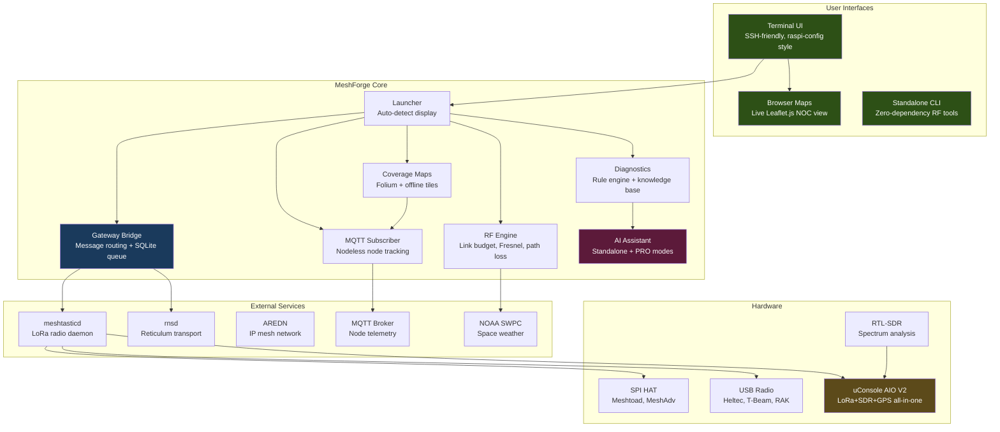
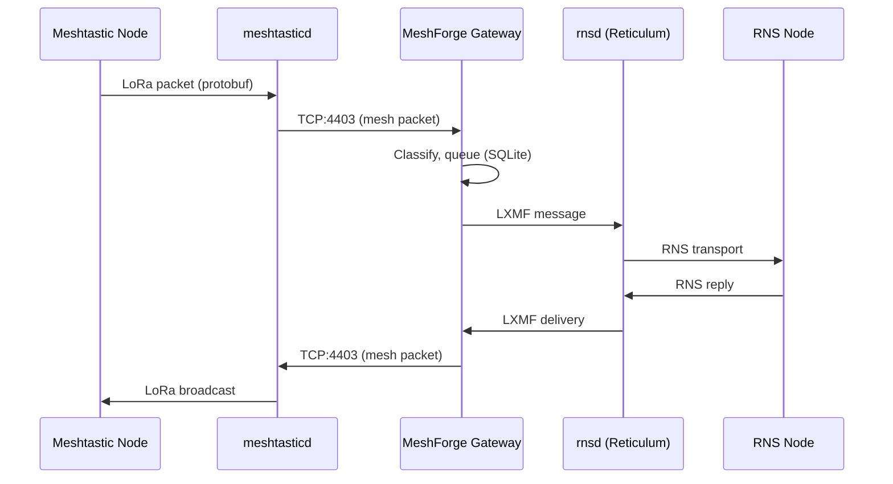

# MeshForge

<p align="center">
  
</p>

<p align="center">
  <strong>Turnkey Mesh Network Operations Center</strong><br>
  <em>Meshtastic + Reticulum + AREDN — One Box, One Interface</em>
</p>

<p align="center">
  <a href="https://github.com/Nursedude/meshforge"></a>
  <a href="LICENSE"></a>
  <a href="https://python.org"></a>
  <a href="https://github.com/Nursedude/meshforge/actions"></a>
</p>

<p align="center">
  <a href="https://nursedude.substack.com">Development Blog</a> |
  <a href="https://github.com/Nursedude/meshforge/issues">Report Issues</a> |
  <a href="#contributing">Contribute</a>
</p>

---

## What is MeshForge?

**MeshForge turns a Raspberry Pi into a mesh network operations center.**

Plug in a LoRa radio, run the installer, and you get:
- A **gateway** bridging Meshtastic and Reticulum networks
- **Coverage maps** with SNR-based link quality
- **RF engineering tools** for site planning
- **AI diagnostics** that work offline

It's the first open-source tool to bridge Meshtastic (LoRa mesh) with Reticulum (encrypted transport). SSH in from anywhere and manage everything from one terminal.

```bash
sudo python3 src/launcher_tui/main.py
```

**Built for:** HAM operators, emergency comms teams, off-grid builders, and mesh enthusiasts.

---

## Quick Start

```bash
git clone https://github.com/Nursedude/meshforge.git
cd meshforge
sudo bash scripts/install_noc.sh    # Full install
```

Or if you already have meshtasticd:
```bash
sudo python3 src/launcher_tui/main.py
```

RF tools only (no sudo, no radio):
```bash
python3 src/standalone.py
```

---

## What Works (v0.4.7-beta)

| Category | Capabilities | Status |
|----------|-------------|--------|
| **Radio Management** | Install/configure meshtasticd, LoRa presets, channels, SPI/USB auto-detect | Working |
| **Multi-Mesh Gateway** | Meshtastic ↔ RNS bridge, persistent message queue (SQLite), routing | Working |
| **Network Monitoring** | MQTT node tracking, live logs, port inspection, service health | Working |
| **Coverage Maps** | Interactive Folium maps, SNR-based link quality, offline tile caching | Working |
| **RF Engineering** | Link budget, Fresnel zone, path loss, site planning, space weather | Working |
| **AI Diagnostics** | Offline knowledge base (20+ topics), rule-based troubleshooting | Working |
| **AI PRO Mode** | Claude API integration, log analysis, predictive diagnostics | Working (requires API key) |
| **Reticulum** | Config editor, interface templates, auto-deploy, rnstatus/rnpath | Working |
| **AREDN** | Node discovery, link quality, service enumeration | Working |
| **uConsole AIO V2** | Hardware detection, GPIO power control, meshtasticd auto-config | Code Ready (hardware Q2 2026) |

### Roadmap

| Feature | Status |
|---------|--------|
| Packet decode (protobuf + RNS frames) | Planned |
| SDR spectrum analysis (RTL-SDR) | Planned |
| GPS tracking + GPX export | Planned |
| Multi-hop path visualization | Planned |

*Goal: Wireshark-grade visibility into mesh traffic.*

---

## Architecture



### Data Flow: Multi-Mesh Bridge



### Design Principles

- **TUI is a dispatcher** — selects what to run, not how to run it
- **Services run independently** — MeshForge connects, never embeds
- **Standard Linux tools** — `systemctl`, `journalctl`, `meshtastic`, `rnstatus`
- **Config overlays** — writes to `config.d/`, never overwrites defaults
- **Graceful degradation** — missing dependencies disable features, don't crash

---

## AI Intelligence

MeshForge includes two tiers of AI-powered network diagnostics:

### Standalone Mode (No Internet Required)
- 20+ topic knowledge base covering mesh networking fundamentals
- Rule-based diagnostic engine with pattern matching
- Structured troubleshooting guides for common issues
- Confidence scoring on diagnoses
- Works completely offline — ideal for field deployment

### PRO Mode (Claude API)
- Natural language troubleshooting ("Why is my node offline?")
- Log file analysis with suggested actions
- Context-aware responses (knows your network topology)
- Predictive issue detection
- Expertise-level adaptation (novice → expert)
- Falls back to Standalone when API unavailable

```python
from utils.claude_assistant import ClaudeAssistant

assistant = ClaudeAssistant()  # Auto-detects mode
response = assistant.ask("Node !abc123 has -15dB SNR, is that okay?")
print(response.answer)
print(response.suggested_actions)
```

---

## uConsole: All-In-One Field Unit

MeshForge has first-class support for the [HackerGadgets uConsole AIO V2](https://hackergadgets.com/products/uconsole-aio-v2) — a portable mesh operations terminal:

| Component | Capability |
|-----------|-----------|
| **SX1262 LoRa** | 860-960MHz, 22dBm, native Meshtastic via SPI |
| **RTL-SDR** | RTL2832U + R860, 100KHz-1.74GHz spectrum |
| **GPS/GNSS** | Multi-constellation (GPS/BDS/GLONASS) |
| **RTC** | PCF85063A with battery backup |
| **Ethernet** | RJ45 Gigabit (wired AREDN backhaul) |

Auto-detection, GPIO power control, and meshtasticd config generation are implemented. Hardware arrives Q2 2026.

---

## Hardware

**Minimum:** Raspberry Pi 3B+ or Pi Zero 2W + any Meshtastic radio

| Component | Options |
|-----------|---------|
| **Computer** | Raspberry Pi 4/5 (recommended), Pi 3B+, Pi Zero 2W |
| **OS** | Raspberry Pi OS Bookworm 64-bit, Debian 12+, Ubuntu 22.04+ |
| **Radio (SPI)** | Meshtoad, MeshAdv-Pi-Hat, Waveshare SX1262 |
| **Radio (USB)** | Heltec V3, T-Beam, RAK4631 |

**Cost:** ~$90 (Pi 4 + SPI HAT)

---

## Coverage Maps

Interactive network visualization powered by Folium:

- **Node markers** with status, battery, RSSI, hardware info
- **SNR-based link coloring** — green (excellent) → red (marginal)
- **Coverage radius estimation** based on LoRa preset
- **Offline tile caching** — works without internet in the field
- **Multiple tile layers** — OpenStreetMap, Terrain, Satellite
- **Heatmap generation** — node density visualization
- **GeoJSON import/export** — interoperate with other tools

```python
from utils.coverage_map import CoverageMapGenerator

gen = CoverageMapGenerator(offline=True)
gen.add_nodes_from_geojson(node_data)
gen.generate("field_coverage.html")  # Opens in any browser
```

---

## Project Structure

```
src/
├── launcher_tui/          # Terminal UI (primary interface)
│   ├── main.py            # NOC dispatcher + menus
│   ├── backend.py         # whiptail/dialog abstraction
│   └── *_mixin.py         # Feature modules (RF, channels, AI, system)
├── gateway/               # Multi-mesh bridge
│   ├── rns_bridge.py      # Meshtastic ↔ RNS transport
│   ├── message_queue.py   # Persistent SQLite queue
│   └── node_tracker.py    # Unified node discovery
├── monitoring/            # Network monitoring
│   └── mqtt_subscriber.py # Nodeless MQTT node tracking
├── utils/                 # Core utilities
│   ├── rf.py              # RF calculations (1302 tests)
│   ├── coverage_map.py    # Folium map generator + tile cache
│   ├── diagnostic_engine.py # Rule-based AI diagnostics
│   ├── claude_assistant.py  # AI assistant (Standalone + PRO)
│   ├── knowledge_base.py   # 20+ mesh networking topics
│   ├── uconsole.py        # uConsole AIO V2 hardware profile
│   ├── aredn.py           # AREDN mesh client
│   └── paths.py           # Sudo-safe path resolution
├── standalone.py          # Zero-dependency RF tools
└── __version__.py         # Version tracking
```

---

## Configuration

### meshtasticd

MeshForge writes hardware config overlays (never overwrites defaults):

```
/etc/meshtasticd/
├── config.yaml                    # Package default (DO NOT EDIT)
└── config.d/
    ├── lora-*.yaml                # Hardware config (SPI pins, module)
    └── meshforge-overrides.yaml   # Custom overrides
```

LoRa modem presets and frequency slots are applied via the meshtastic
CLI (`--set lora.modem_preset`, `--set lora.channel_num`), not config.d.

### Reticulum

Auto-deploys a working config from `templates/reticulum.conf`:
- AutoInterface (LAN discovery)
- Meshtastic Interface on `127.0.0.1:4403`
- RNode LoRa (optional, for dedicated RNS radio)

### Ports

| Port | Service |
|------|---------|
| 4403 | meshtasticd TCP API |
| 9443 | meshtasticd Web UI |

---

## Contributing

```bash
python3 -m pytest tests/ -v      # Run tests
python3 scripts/lint.py --all    # Security linter
```

**Code rules:** No `shell=True`, no bare `except:`, use `get_real_user_home()` not `Path.home()`.

See [CLAUDE.md](CLAUDE.md) for details.

---

## Branches

| Branch | Purpose | Stability |
|--------|---------|-----------|
| `main` | Gateway bridge, production features | Stable |
| `alpha` | Map development, experimental | Testing |

```bash
git checkout alpha    # Switch to experimental
```

---

## Resources

| Resource | Link | Relation |
|----------|------|----------|
| Development Blog | [nursedude.substack.com](https://nursedude.substack.com) | Project updates |
| Meshtastic Docs | [meshtastic.org/docs](https://meshtastic.org/docs/) | Primary radio network |
| Reticulum Network | [reticulum.network](https://reticulum.network/) | Bridge target (encrypted transport) |
| AREDN Mesh | [arednmesh.org](https://www.arednmesh.org/) | Monitoring integration |
| RTL-SDR | [rtl-sdr.com](https://www.rtl-sdr.com/) | Spectrum analysis (planned) |
| uConsole AIO V2 | [hackergadgets.com](https://hackergadgets.com/products/uconsole-aio-v2) | Field hardware (Q2 2026) |
| MeshCore | [meshcore.co](https://meshcore.co/) | Future research |

---

## License

GPL-3.0 — See [LICENSE](LICENSE)

---

<p align="center">
  <br>
  <strong>MeshForge</strong><br>
  <em>Made with aloha for the mesh community</em><br>
  WH6GXZ | Hawaii
</p>
