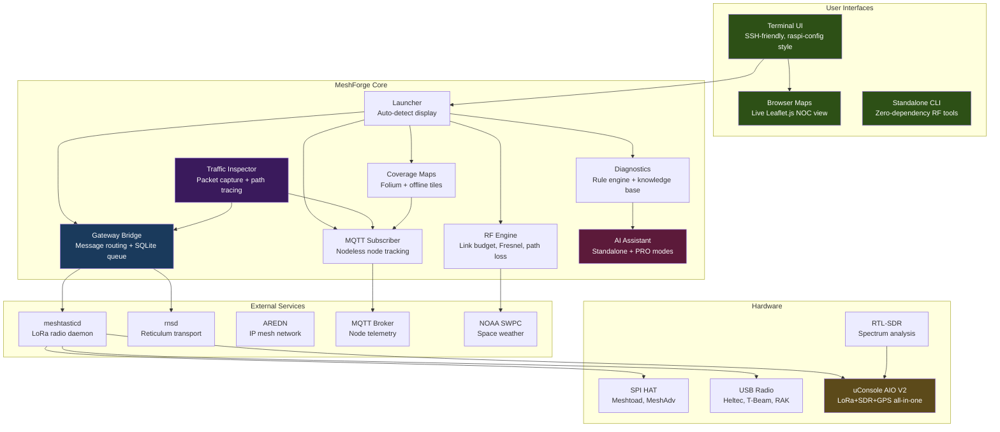
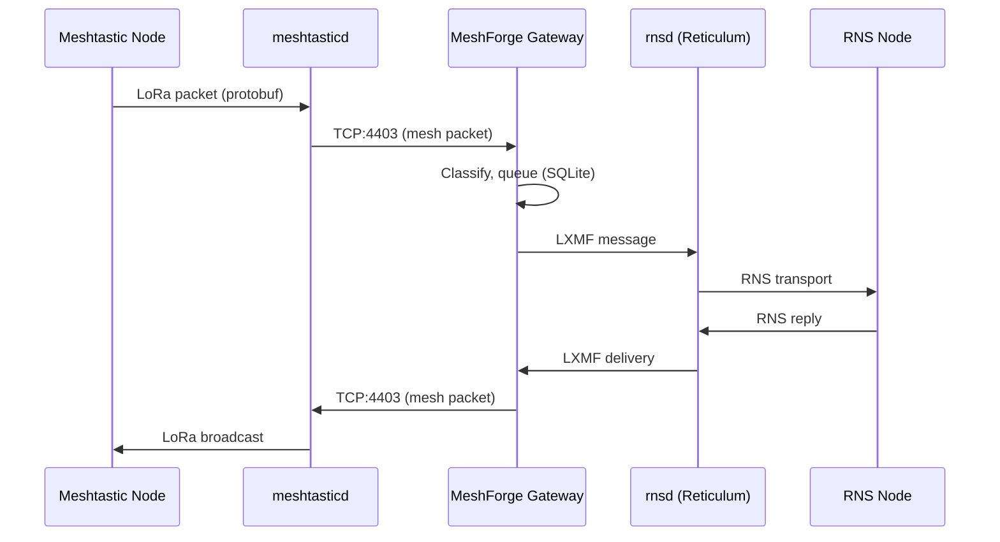

# MeshForge

<p align="center">
  
</p>

<p align="center">
  <strong>Turnkey Mesh Network Operations Center</strong><br>
  <em>Meshtastic + Reticulum + AREDN — One Box, One Interface</em>
</p>

<p align="center">
  <a href="https://github.com/Nursedude/meshforge"></a>
  <a href="LICENSE"></a>
  <a href="https://python.org"></a>
  <a href="https://github.com/Nursedude/meshforge/actions"></a>
</p>

<p align="center">
  <a href="https://nursedude.substack.com">Development Blog</a> |
  <a href="https://github.com/Nursedude/meshforge/issues">Report Issues</a> |
  <a href="#contributing">Contribute</a>
</p>

---

## What is MeshForge?

**MeshForge turns a Raspberry Pi into a mesh network operations center.**

Plug in a LoRa radio, run the installer, and you get:
- A **gateway** bridging Meshtastic and Reticulum networks
- **Live NOC maps** showing Meshtastic AND RNS nodes on one map
- **Coverage maps** with SNR-based link quality
- **RF engineering tools** for site planning
- **AI diagnostics** that work offline

### The Vision

Modern mesh networks are fragmented. Meshtastic nodes can't talk to Reticulum nodes. AREDN operates on a different layer entirely. Each ecosystem has its own tools, its own interfaces, its own learning curve.

**MeshForge unifies them.**

One interface to monitor Meshtastic, Reticulum, and AREDN. One gateway to bridge messages between incompatible meshes. One toolkit for RF planning, diagnostics, and field operations. All running on a $35 Raspberry Pi that you can SSH into from anywhere.

This is the first open-source tool to bridge Meshtastic (LoRa mesh) with Reticulum (encrypted transport layer). No cloud dependencies. No subscriptions. Just a box that makes mesh networks work together.

```bash
sudo python3 src/launcher_tui/main.py
```

**Built for:** HAM operators, emergency comms teams, off-grid builders, preppers, and mesh enthusiasts who want professional-grade network visibility without the complexity.

---

## Quick Start

```bash
git clone https://github.com/Nursedude/meshforge.git
cd meshforge
sudo bash scripts/install_noc.sh    # Full install
```

Or if you already have meshtasticd:
```bash
sudo python3 src/launcher_tui/main.py
```

RF tools only (no sudo, no radio):
```bash
python3 src/standalone.py
```

### TUI Menu Structure

The TUI uses a raspi-config style interface (whiptail/dialog) designed for SSH and
headless operation. Navigation is keyboard-driven with max 10 items per menu level:

```
Main Menu (MeshForge NOC)
├── 1. Dashboard             Service status, health, alerts, data path check
├── 2. Mesh Networks         Meshtastic, RNS, AREDN, MQTT, Gateway, Favorites
├── 3. RF & SDR              Link budget, site planner, frequency slots, SDR
├── 4. Maps & Viz            Live NOC map, coverage, topology, traffic inspector
├── 5. Configuration         Radio, channels, RNS config, services, backup
├── 6. System                Hardware detect, logs, network tools, shell, reboot
├── q. Quick Actions         Common shortcuts (2-tap access)
├── e. Emergency Mode        Field ops, weather/EAS alerts, SOS beacon
├── a. About                 Version, web client, help
└── x. Exit
```

**Design principles** (inspired by
[raspi-config](https://www.raspberrypi.com/documentation/computers/configuration.html)):
- Max 10 items per menu (cognitive load limit)
- Grouped by user task, not technical domain
- 2-tap max for common operations via Quick Actions
- Startup checks detect conflicts, verify services, warn on misconfigs

---

## Upgrading MeshForge

### Clean Reinstall (Recommended)

The cleanest way to upgrade MeshForge — guarantees you get the latest code,
dependencies, and system integration without stale files or merge conflicts:

```bash
sudo bash /opt/meshforge/scripts/reinstall.sh
```

**What it does:**
1. Backs up your configs (`/etc/meshforge/`, `/etc/meshtasticd/config.d/`, `~/.config/meshforge/`)
2. Stops MeshForge services (meshforge, meshforge-map)
3. Removes `/opt/meshforge` completely (source + venv)
4. Fresh `git clone` from GitHub
5. Runs `install_noc.sh` to rebuild everything
6. Restores your backed-up configs

**What it does NOT touch:**
- meshtasticd (apt package, service, `/etc/meshtasticd/config.yaml`)
- Reticulum/rnsd installation
- Your radio configs in `/etc/meshtasticd/config.d/`
- MQTT broker (mosquitto)
- System packages

No need to re-image your Pi. Your radio stays configured.

### Quick Update (Git Pull)

For developers or when you know the update is minor:

```bash
cd /opt/meshforge && sudo bash scripts/update.sh
```

Or manually:
```bash
cd /opt/meshforge && sudo git pull origin main
```

**When to use git pull:** Small code changes, you track the repo, no dependency changes.

**When to use clean reinstall:** New dependencies, major version bumps, import errors,
stale `.pyc` files, or anything that "doesn't look right" after a pull.

### Switch Branches

All active development is on `main`. The `alpha` branch contains firmware
and NanoVNA research work and is not synchronized with main.

```bash
# If you're on alpha, switch to main for current features:
cd /opt/meshforge
git checkout main
sudo bash scripts/update.sh
```

### Post-Upgrade Verification

```bash
# Check new version
python3 -c "from src.__version__ import __version__; print(__version__)"

# Verify TUI launches
sudo python3 src/launcher_tui/main.py

# Check services are running
systemctl status meshtasticd
systemctl status rnsd
```

### Troubleshooting Upgrades

| Issue | Solution |
|-------|----------|
| Python import errors | `sudo bash scripts/reinstall.sh` (clean reinstall) |
| `Local changes would be overwritten` | `git stash` before pull, or use clean reinstall |
| Service won't start | Check logs: `journalctl -u meshtasticd -n 50` |
| Config file conflicts | Restore from `~/meshforge-backup-*` or regenerate via TUI |
| `meshtastic` module errors | See "Python Library Conflicts" below |
| Stale `.pyc` files | Clean reinstall handles this automatically |

#### Python Library Conflicts

On some systems (especially Raspberry Pi OS with externally-managed Python), the `meshtastic` library may fail to install due to version conflicts. If you see errors like "externally-managed-environment" or module import failures:

```bash
# Force reinstall meshtastic (use with caution)
pip install meshtastic --break-system-packages --ignore-installed

# Alternative: use a virtual environment
python3 -m venv ~/.meshforge-venv
source ~/.meshforge-venv/bin/activate
pip install meshtastic
```

Note: The `--break-system-packages` flag bypasses PEP 668 protections. Only use this if you understand the implications for your system Python environment.

### Version History

See the full changelog in `src/__version__.py` or run:
```bash
python3 -c "from src.__version__ import show_version_history; show_version_history()"
```

---

## What Works (v0.5.2-beta)

| Category | Capabilities | Status |
|----------|-------------|--------|
| **TUI Interface** | Installer, service control, device config wizard, gateway config, diagnostics | Stable |
| **TUI Reliability** | Defense-in-depth error handling — 16 mixin dispatch loops protected with `_safe_call` | Stable |
| **Radio Management** | Install/configure meshtasticd, LoRa presets, channels, SPI/USB auto-detect | Stable |
| **RF Engineering** | Link budget, Fresnel zone, path loss, site planning, space weather | Stable |
| **AI Diagnostics** | Offline knowledge base (20+ topics), rule-based troubleshooting | Stable |
| **NomadNet/RNS** | Config editor, interface templates, rnstatus/rnpath, identity management | Stable |
| **Emergency Alerts** | NOAA/NWS weather, USGS volcano, FEMA iPAWS — accessible from Emergency Mode | Beta |
| **Node Favorites** | Meshtastic 2.7+ favorites management, sync with device, filter by favorites | Beta |
| **MQTT Monitoring** | Nodeless mesh observation, protobuf decode, telemetry tracking, congestion alerts | Beta |
| **Coverage Maps** | Interactive Folium maps, SNR-based link quality, offline tile caching | Beta |
| **Live NOC Map** | Browser view with WebSocket updates, node markers, signal heatmap | Beta |
| **Network Monitoring** | MQTT node tracking, live logs, port inspection, service health | Beta |
| **Multi-Mesh Gateway** | Meshtastic ↔ RNS bridge (LXMF), persistent queue (SQLite), WebSocket broadcast | Alpha |
| **Traffic Inspector** | Packet capture from meshtastic callbacks, protocol tree, display filters, path tracing | Beta |
| **Prometheus Metrics** | HTTP endpoint on port 9090, metrics exporter | Beta |
| **Grafana Dashboards** | Pre-built JSON dashboards, manual import required | Dashboards Ready |
| **AREDN** | Node discovery, link quality, service enumeration (correct API, needs hardware) | Code Ready |
| **AI PRO Mode** | Claude API integration, log analysis, predictive diagnostics | Beta (requires API key) |
| **Protobuf HTTP Client** | Full device config via protobuf HTTP (8 device + 13 module configs, channels, traceroute, neighbor info) | Beta |
| **Config API** | RESTful configuration management with NGINX reliability patterns | Beta |
| **uConsole AIO V2** | Hardware detection, GPIO power control, meshtasticd auto-config | Code Ready (hardware Q2 2026) |

**Status key:** Stable = tested in the field | Beta = works but needs soak time | Alpha = architecture solid, needs testing | Code Ready = implemented, no hardware to validate

### Roadmap

| Feature | Target | Status |
|---------|--------|--------|
| Historical playback (Live Map Phase 6) | Q2 2026 | Planned |
| Packet decode (protobuf + RNS frames) | Q2 2026 | Planned |
| SDR spectrum analysis (RTL-SDR) | Q2 2026 | Planned |
| GPS tracking + GPX export | Q2 2026 | Planned |
| NanoVNA antenna integration | Q2 2026 | Alpha |
| Firmware flashing | Q3 2026 | Alpha (high risk) |

### Known Limitations

| Feature | Limitation | Workaround |
|---------|-----------|------------|
| **Live NOC Map** | Node trails require historical data | Enable MQTT subscriber for data collection |
| **Grafana** | Dashboards require manual import | See `dashboards/README.md` for instructions |
| **TCP:4403** | Only one client can connect | Use MQTT path for multi-consumer scenarios |
| **WebSocket** | Requires Gateway Bridge or MQTT bridge | Start one of the bridges first |

*Goal: Complete network operations visibility with historical analysis.*

---

## Architecture



### Data Flow: Multi-Mesh Bridge



### MQTT Multi-Consumer Architecture

MeshForge supports dual data paths from meshtasticd:

```
meshtasticd
    ├── TCP:4403 → Gateway Bridge → RNS transport → WebSocket:5001
    │              (exclusive - one client)
    │
    └── MQTT → mosquitto:1883 → MQTT Subscriber (MeshForge)
                              → meshing-around
                              → Grafana/InfluxDB
                              → other consumers (unlimited)
```

**Key insight**: TCP:4403 allows only one client, but MQTT supports unlimited subscribers.

**Setup via TUI**:
- MQTT Setup Wizard: `Configuration → Service Config → MQTT Setup`
- MQTT Monitor: `Mesh Networks → MQTT Monitor → Configure → Use Local Broker`
- WebSocket Bridge: `MQTT Monitor → WebSocket Bridge` (for web UI without Gateway Bridge)

### Design Principles

- **TUI is a dispatcher** — selects what to run, not how to run it
- **Services run independently** — MeshForge connects, never embeds
- **Standard Linux tools** — `systemctl`, `journalctl`, `meshtastic`, `rnstatus`
- **Config overlays** — writes to `config.d/`, never overwrites defaults
- **Graceful degradation** — missing dependencies disable features, don't crash
- **Defense-in-depth** — every mixin dispatch uses `_safe_call` to catch exceptions and return to menu

---

## AI Intelligence

MeshForge includes two tiers of AI-powered network diagnostics:

### Standalone Mode (No Internet Required)
- 20+ topic knowledge base covering mesh networking fundamentals
- Rule-based diagnostic engine with pattern matching
- Structured troubleshooting guides for common issues
- Confidence scoring on diagnoses
- Works completely offline — ideal for field deployment

### PRO Mode (Claude API)
- Natural language troubleshooting ("Why is my node offline?")
- Log file analysis with suggested actions
- Context-aware responses (knows your network topology)
- Predictive issue detection
- Expertise-level adaptation (novice → expert)
- Falls back to Standalone when API unavailable

```python
from utils.claude_assistant import ClaudeAssistant

assistant = ClaudeAssistant()  # Auto-detects mode
response = assistant.ask("Node !abc123 has -15dB SNR, is that okay?")
print(response.answer)
print(response.suggested_actions)
```

---

## uConsole: All-In-One Field Unit

MeshForge has first-class support for the [HackerGadgets uConsole AIO V2](https://hackergadgets.com/products/uconsole-aio-v2) — a portable mesh operations terminal:

| Component | Capability |
|-----------|-----------|
| **SX1262 LoRa** | 860-960MHz, 22dBm, native Meshtastic via SPI |
| **RTL-SDR** | RTL2832U + R860, 100KHz-1.74GHz spectrum |
| **GPS/GNSS** | Multi-constellation (GPS/BDS/GLONASS) |
| **RTC** | PCF85063A with battery backup |
| **Ethernet** | RJ45 Gigabit (wired AREDN backhaul) |

Auto-detection, GPIO power control, and meshtasticd config generation are implemented. Hardware arrives Q2 2026.

---

## Hardware

**Minimum:** Raspberry Pi 3B+ or Pi Zero 2W + any Meshtastic radio

| Component | Options |
|-----------|---------|
| **Computer** | Raspberry Pi 4/5 (recommended), Pi 3B+, Pi Zero 2W |
| **OS** | Raspberry Pi OS Bookworm 64-bit, Debian 12+, Ubuntu 22.04+ |
| **Radio (SPI)** | Meshtoad, MeshAdv-Pi-Hat, Waveshare SX1262 |
| **Radio (USB)** | Heltec V3, T-Beam, RAK4631 |

**Cost:** ~$90 (Pi 4 + SPI HAT)

---

## Coverage Maps

Interactive network visualization powered by Folium and Leaflet.js:

### Static Coverage Maps (Stable)

- **Node markers** with status, battery, RSSI, hardware info
- **SNR-based link coloring** — green (excellent) → red (marginal)
- **Coverage radius estimation** based on LoRa preset
- **Offline tile caching** — works without internet in the field
- **Multiple tile layers** — OpenStreetMap, Terrain, Satellite
- **Heatmap generation** — node density visualization
- **GeoJSON import/export** — interoperate with other tools

```python
from utils.coverage_map import CoverageMapGenerator

gen = CoverageMapGenerator(offline=True)
gen.add_nodes_from_geojson(node_data)
gen.generate("field_coverage.html")  # Opens in any browser
```

### Live NOC Map (Beta)

Real-time browser-based network operations view at `http://localhost:5000`:

**Working Features**:
- **WebSocket updates** — real-time node position refresh (requires bridge running)
- **Node markers** — color-coded by status (online/stale/offline)
- **Signal heatmap** — toggle SNR-based heat visualization
- **Node popup details** — battery, SNR, hardware, altitude
- **Node list** — click to focus map on node

**In Development**:
- **Node trails** — requires historical data collection (enable MQTT subscriber)
- **Network topology** — D3.js force-directed graph view
- **Alert system** — visual notifications for node events

**Access**:
```bash
# Via TUI: Maps → Start Map Server
# Or directly:
sudo python3 src/utils/map_data_service.py
# Open http://localhost:5000 in browser
```

**Data Sources**:
- Gateway Bridge → WebSocket:5001 (real-time)
- MQTT Subscriber → mosquitto:1883 (multi-consumer)
- MQTT → WebSocket Bridge (connects MQTT to web UI)

---

## Project Structure

```
src/
├── launcher_tui/          # Terminal UI (primary interface)
│   ├── main.py            # NOC dispatcher + menus (1,364 lines)
│   ├── backend.py         # whiptail/dialog abstraction
│   ├── startup_checks.py  # Environment checks + conflict resolution
│   ├── status_bar.py      # Service status bar
│   └── *_mixin.py         # 30 feature modules (RF, channels, AI, system, etc.)
├── gateway/               # Multi-mesh bridge
│   ├── rns_bridge.py      # Meshtastic ↔ RNS transport
│   ├── message_queue.py   # Persistent SQLite queue
│   ├── node_tracker.py    # Unified node discovery
│   ├── meshtastic_protobuf_client.py  # Protobuf-over-HTTP transport
│   └── meshtastic_protobuf_ops.py     # Protobuf data classes + parsers
├── monitoring/            # Network monitoring
│   ├── mqtt_subscriber.py # Nodeless MQTT node tracking
│   ├── traffic_inspector.py # Packet capture + protocol analysis
│   └── path_visualizer.py # Multi-hop path tracing
├── utils/                 # Core utilities
│   ├── rf.py              # RF calculations (well-tested)
│   ├── coverage_map.py    # Folium map generator + tile cache
│   ├── config_api.py      # RESTful configuration API
│   ├── diagnostic_engine.py # Rule-based AI diagnostics
│   ├── diagnostic_rules.py  # Diagnostic rule definitions
│   ├── claude_assistant.py  # AI assistant (Standalone + PRO)
│   ├── knowledge_base.py   # Core knowledge base class
│   ├── knowledge_content.py # 20+ mesh networking topics
│   ├── shared_health_state.py # Cross-component health tracking
│   ├── metrics_export.py   # Prometheus/JSON metrics export
│   ├── uconsole.py        # uConsole AIO V2 hardware profile
│   ├── aredn.py           # AREDN mesh client
│   └── paths.py           # Sudo-safe path resolution
├── standalone.py          # Zero-dependency RF tools
└── __version__.py         # Version tracking

dashboards/                # Grafana monitoring dashboards
├── meshforge-overview.json  # Health, services, queues
├── meshforge-nodes.json     # Per-node RF metrics
└── meshforge-gateway.json   # Gateway bridge status

templates/
└── gateway-pair/          # Multi-preset bridging templates
    ├── node-a.yaml        # First gateway node config
    └── node-b.yaml        # Second gateway node config
```

---

## Configuration

### meshtasticd

MeshForge writes hardware config overlays (never overwrites defaults):

```
/etc/meshtasticd/
├── config.yaml                    # Package default (DO NOT EDIT)
└── config.d/
    ├── lora-*.yaml                # Hardware config (SPI pins, module)
    └── meshforge-overrides.yaml   # Custom overrides
```

LoRa modem presets and frequency slots are applied via the meshtastic
CLI (`--set lora.modem_preset`, `--set lora.channel_num`), not config.d.

### Reticulum

Auto-deploys a working config from `templates/reticulum.conf`:
- AutoInterface (LAN discovery)
- Meshtastic Interface on `127.0.0.1:4403`
- RNode LoRa (optional, for dedicated RNS radio)

### Prometheus Metrics

MeshForge exports metrics for monitoring with Prometheus and Grafana:

```python
from utils.metrics_export import start_metrics_server

server = start_metrics_server(port=9090)
# Metrics at http://localhost:9090/metrics
```

**TUI Access**: `Tools → Historical Metrics → Prometheus Server → Start Server`

### Grafana Dashboards

Pre-built dashboards are available in `dashboards/`:

| Dashboard | Description |
|-----------|-------------|
| `meshforge-overview.json` | Health scores, service status, message queues |
| `meshforge-nodes.json` | Per-node SNR, RSSI, battery metrics |
| `meshforge-gateway.json` | Gateway connections, message flow |

**Setup Requirements**:
1. Install Prometheus and Grafana separately
2. Start MeshForge metrics server (port 9090)
3. Add Prometheus scrape target for `localhost:9090`
4. Import dashboards via Grafana UI → Dashboards → Import

See `dashboards/README.md` and `docs/METRICS.md` for full setup instructions.

### Ports

| Port | Service | Owner | Notes |
|------|---------|-------|-------|
| 4403 | meshtasticd TCP API | meshtasticd | Single client limit |
| 1883 | mosquitto MQTT | mosquitto | Multi-consumer (optional) |
| 5000 | MeshForge Map Server | **MeshForge** | Live NOC map + REST API (20 endpoints) |
| 5001 | MeshForge WebSocket | **MeshForge** | Real-time message broadcast |
| 8081 | MeshForge Config API | **MeshForge** | RESTful config management |
| 9090 | Prometheus metrics | **MeshForge** | Prometheus + Grafana JSON API |
| 9443 | meshtasticd Web UI | meshtasticd | Protobuf + JSON endpoints |

### API Reference

MeshForge serves **42+ REST endpoints** across 4 HTTP servers. All APIs are
local-only (LAN/localhost) with CORS enabled for browser access.

#### Map Server (port 5000)

| Method | Endpoint | Returns |
|--------|----------|---------|
| GET | `/api/nodes/geojson` | Unified GeoJSON from all sources (Meshtastic, MQTT, RNS) |
| GET | `/api/nodes/history` | 24-hour node statistics |
| GET | `/api/nodes/trajectory/<id>` | Node movement trail (GeoJSON LineString) |
| GET | `/api/network/topology` | D3.js force-directed graph data |
| GET | `/api/coverage/<lat>/<lon>/<h>` | Terrain-aware RF coverage prediction |
| GET | `/api/los/<lat1>/<lon1>/<lat2>/<lon2>` | Line-of-sight + Fresnel zone analysis |
| GET | `/api/radio/info` | Radio device info (wraps meshtasticd) |
| GET | `/api/radio/nodes` | Nodes from connected radio |
| GET | `/api/radio/channels` | Channel list from radio |
| GET | `/api/radio/status` | Radio connection state |
| POST | `/api/radio/message` | Send message via radio |
| GET | `/api/messages/queue` | Outbound message queue |
| GET | `/api/messages/received` | Received messages |
| GET | `/api/status` | Server health + radio status |

#### Prometheus Metrics (port 9090)

| Method | Endpoint | Returns |
|--------|----------|---------|
| GET | `/metrics` | Prometheus exposition format (50+ metric families) |
| GET | `/api/v1/query` | PromQL query (Grafana compatible) |
| GET | `/api/v1/query_range` | Time-series range query |
| GET | `/api/json/nodes` | Node metrics as JSON |
| GET | `/api/json/status` | System status JSON |

#### Config API (port 8081)

| Method | Endpoint | Purpose |
|--------|----------|---------|
| GET | `/config[/<path>]` | Read config value(s) |
| PUT | `/config/<path>` | Set config value (validated) |
| DELETE | `/config/<path>` | Reset to default |
| POST | `/config/_reset` | Factory reset all config |
| GET | `/config/_audit` | Change audit log |

#### Protobuf Transport (via meshtasticd port 9443)

MeshForge's `MeshtasticProtobufClient` communicates with meshtasticd's
protobuf endpoints for full device control without consuming the TCP
connection (port 4403):

| Operation | Protocol | Description |
|-----------|----------|-------------|
| Config read/write | AdminMessage | All 8 device + 13 module config sections |
| Channel management | AdminMessage | Get/set channels 0-7 |
| Owner management | AdminMessage | Get/set device name |
| Neighbor info | NEIGHBORINFO_APP | Parse neighbor tables from mesh broadcasts |
| Device metadata | AdminMessage | Firmware version, capabilities, hardware model |
| Traceroute | TRACEROUTE_APP | Multi-hop route discovery with SNR |
| Position request | POSITION_APP | Request GPS position from remote nodes |
| Event polling | FromRadio stream | Background thread dispatches events via callbacks |

---

## Code Health

Auto-review system scans 243 files for security, reliability, and performance issues:

```bash
cd src && python3 -c "
from utils.auto_review import ReviewOrchestrator
r = ReviewOrchestrator()
report = r.run_full_review()
print(f'Issues: {report.total_issues}, Files scanned: {report.total_files_scanned}')
"
```

**Tracked issues** (see `.claude/foundations/persistent_issues.md`):

| Rule | Description | Status |
|------|-------------|--------|
| MF001 | `Path.home()` → use `get_real_user_home()` for sudo safety | Active monitoring |
| MF002 | No `shell=True` in subprocess calls | Active monitoring |
| MF003 | No bare `except:` — specify exception types | Active monitoring |
| MF004 | All subprocess calls need `timeout` parameter | Active monitoring |

**Reliability patterns** (inspired by [Raspberry Pi systemd best practices](https://www.thedigitalpictureframe.com/ultimate-guide-systemd-autostart-scripts-raspberry-pi/)):
- Services use `Restart=always` with `RestartSec=3` for auto-recovery
- Pre-flight `check_service()` before connecting to meshtasticd/rnsd
- Shared connection manager prevents TCP:4403 client contention
- Exponential backoff reconnection (1s → 2s → 4s → ... → 30s max)

---

## Contributing

```bash
python3 -m pytest tests/ -v      # Run tests
python3 scripts/lint.py --all    # Security linter
```

**Code rules:** No `shell=True`, no bare `except:`, use `get_real_user_home()` not `Path.home()`.

See [CLAUDE.md](CLAUDE.md) for details.

---

## Development

Active development on `main`. Feature branches via `claude/` prefix, merged by PR.
`alpha` branch preserved for firmware/NanoVNA research.

```bash
git clone https://github.com/Nursedude/meshforge.git
cd meshforge
sudo bash scripts/install_noc.sh
```

### Quick Update

```bash
# Quick pull (minor updates)
cd /opt/meshforge && sudo bash scripts/update.sh

# Clean reinstall (recommended for major updates)
sudo bash /opt/meshforge/scripts/reinstall.sh
```

See [Upgrading MeshForge](#upgrading-meshforge) for complete instructions including backup and troubleshooting.

### Gateway Configurations

| Configuration | Setup | Status |
|---------------|-------|--------|
| **moc1** | USB LongFast ↔ Short Turbo | Stable |
| **moc2** | HAT Short Turbo ↔ LongFast (two-radio) | Stable |
| **moc3** | HAT LongFast ↔ TBD | Planned |
| **VolcanoAI** | USB LongFast ↔ RNS (desktop) | Stable |

Gateway templates available in `templates/gateway-pair/` for multi-preset bridging.

---

## Resources

| Resource | Link | Relation |
|----------|------|----------|
| Development Blog | [nursedude.substack.com](https://nursedude.substack.com) | Project updates |
| Meshtastic Docs | [meshtastic.org/docs](https://meshtastic.org/docs/) | Primary radio network |
| Reticulum Network | [reticulum.network](https://reticulum.network/) | Bridge target (encrypted transport) |
| AREDN Mesh | [arednmesh.org](https://www.arednmesh.org/) | Monitoring integration |
| RTL-SDR | [rtl-sdr.com](https://www.rtl-sdr.com/) | Spectrum analysis (planned) |
| uConsole AIO V2 | [hackergadgets.com](https://hackergadgets.com/products/uconsole-aio-v2) | Field hardware (Q2 2026) |
| MeshCore | [meshcore.co](https://meshcore.co/) | Future research |

---

## License

GPL-3.0 — See [LICENSE](LICENSE)

---

<p align="center">
  <br>
  <strong>MeshForge</strong><br>
  <em>Made with aloha for the mesh community</em><br>
  WH6GXZ | Hawaii
</p>
