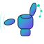
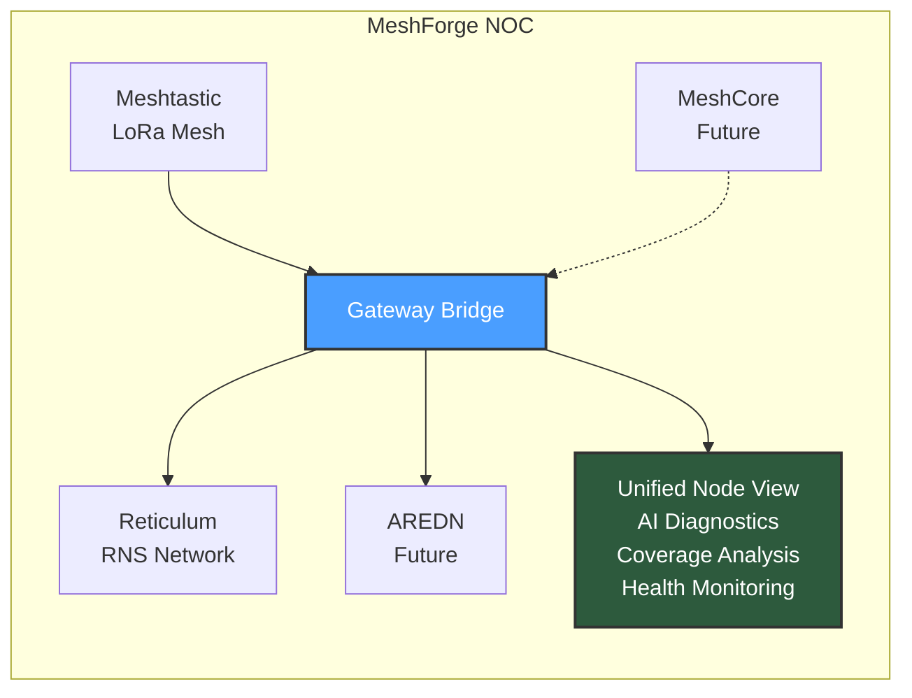
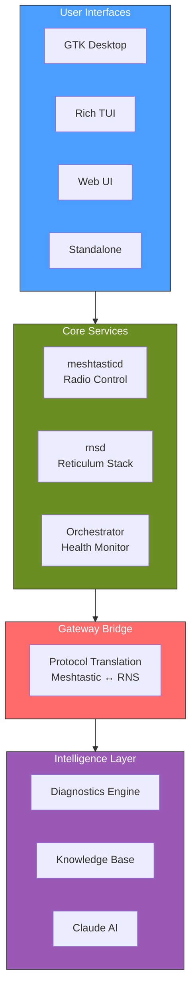

# MeshForge

<p align="center">
  
</p>

<p align="center">
  <strong>Network Operations Center for the Decentralized Mesh Future</strong>
</p>

<p align="center">
  <a href="https://github.com/Nursedude/meshforge"></a>
  <a href="LICENSE"></a>
  <a href="https://python.org"></a>
</p>

<p align="center">
  <a href="https://nursedude.substack.com">Follow on Substack</a> |
  <a href="https://github.com/Nursedude/meshforge/issues">Report Issues</a> |
  <a href="#contributing">Contribute</a>
</p>

## The Vision

**MeshForge is a Network Operations Center (NOC) that unifies fragmented mesh ecosystems into a single, coherent operating environment.**

The mesh networking landscape is fractured. Meshtastic, Reticulum, MeshCore, AREDN - each powerful in isolation, but unable to interoperate. Emergency responders can't bridge networks. Communities build redundant infrastructure. The promise of resilient, decentralized communication remains unfulfilled.

MeshForge changes this.



**First open-source tool designed to bridge incompatible mesh protocols.**

## Current Capabilities (v0.4.7-beta)

> **Honesty Note**: We're being transparent about what works TODAY vs what's in progress.
> See our [development blog](https://nursedude.substack.com) for the full story.

| Feature | Status | What This Means |
|---------|--------|-----------------|
| **Meshtastic Integration** | ✅ Working | SPI HAT and USB radio support via meshtasticd |
| **Install Verification** | ✅ Working | Post-install checks confirm everything works |
| **AI Diagnostics** | ✅ Working | Offline troubleshooting with knowledge base |
| **Coverage Maps** | ✅ Working | Generate SNR-based link quality maps |
| **RF Calculator** | ✅ Working | Link budgets, Fresnel zones, path loss |
| **Multi-Interface** | ✅ Working | GTK, Rich CLI, Web, Standalone modes |
| **Reticulum Bridge** | 🔨 In Progress | RNS transport layer implemented, testing |
| **Gateway Bridge** | 🔨 In Progress | Meshtastic↔RNS routing, needs validation |
| **Health Monitoring** | 🔨 In Progress | Service orchestrator, recently unified |

**What "Working" means**: You can install it, run it, and it does what it says without manual intervention.

**What "In Progress" means**: Code exists, but needs more testing before we call it reliable.

## Roadmap

MeshForge development follows a milestone-based approach. We ship when quality gates pass, not arbitrary dates.

### Phase 1: Foundation (Current)
**Status: Active Development**

Core NOC functionality for Meshtastic and Reticulum networks.

```
[####################] Install & Verification     ← Just completed
[####################] AI Diagnostics Engine      ← Working offline
[####################] RF Tools & Calculators     ← Solid
[##################  ] Meshtastic Integration     ← SPI/USB working, config WIP
[##############      ] Rich CLI Polish            ← Unified, needs testing
[############        ] RNS/Reticulum Bridge       ← Code exists, needs validation
[##########          ] Gateway Message Routing    ← Architecture done, untested
[########            ] GTK4 Desktop Polish        ← Functional, needs UX work
```

**Current Focus**: Reliable installation that works first try. Everything else follows.

### Phase 2: Protocol Expansion & Connection Layer
**Status: Research & Planning**

Integrate additional mesh protocols and improve device connectivity.

| Integration | Protocol | Priority | Notes |
|-------------|----------|----------|-------|
| **MeshCore** | Reticulum-based | High | Emerging protocol, RNS-compatible transport |
| **AREDN** | TCP/IP over ham | Medium | Amateur Radio Emergency Data Network |
| **QMesh** | Experimental | Low | Research phase |

**Connection Abstraction Layer** *(inspired by [meshtastic/standalone-ui](https://github.com/meshtastic/standalone-ui))*:
Unified interface for Serial, TCP, and USB connections - same code works regardless of connection type.

| Feature | Description | Reference |
|---------|-------------|-----------|
| **DeviceController** | MVC pattern for device communication | standalone-ui ViewController |
| **Unified Connection Interface** | Serial/TCP/USB abstraction | SerialClient, UARTClient pattern |
| **Thread-safe Packet Queue** | MeshEnvelope-style encoding | Protobuf packet handling |
| **Offline Map Caching** | Local tile storage for field use | FileLoader SD card integration |

### Phase 3: Advanced NOC
**Status: Design Phase**

Enterprise-grade network operations capabilities.

| Feature | Description |
|---------|-------------|
| **Wireshark Integration** | Packet capture and protocol analysis |
| **Network Topology Discovery** | Automatic mesh mapping |
| **Predictive Analytics** | Link failure prediction using ML |
| **Multi-Gateway Coordination** | Distributed NOC architecture |
| **Historical Analysis** | Long-term network health trends |
| **Internationalization (i18n)** | Multi-language support for global HAM community |

### Phase 4: Ecosystem
**Status: Future**

| Feature | Description |
|---------|-------------|
| **Plugin Architecture** | Third-party protocol adapters |
| **Federation** | NOC-to-NOC communication |
| **Mobile Companion** | iOS/Android status app |
| **LVGL Embedded UI** | Lightweight interface for Pi Zero/embedded deployments |

## Quick Start

```bash
# Clone the repository
git clone https://github.com/Nursedude/meshforge.git
cd meshforge

# Option 1: Full NOC stack (recommended)
sudo bash scripts/install_noc.sh

# Option 2: Minimal install
pip3 install rich textual flask --break-system-packages
sudo python3 src/launcher.py

# Option 3: Zero-dependency standalone
python3 src/standalone.py
```

**First Launch:**
```
MeshForge v0.4.7-beta

Services:
  [OK] meshtasticd: running (port 4403)
  [OK] Hardware: SX1262 detected
  [--] rnsd: not configured (optional)

Network:
  [OK] Nodes visible: 3

Ready! [Continue] [Configure] [Troubleshoot]
```

## Architecture

MeshForge owns the complete stack from radio hardware to user interface:



**Supported Hardware:**

| Category | Devices |
|----------|---------|
| **SPI HATs** | Meshtoad, MeshAdv-Pi-Hat, RAK WisLink, Waveshare SX126x |
| **USB Radios** | T-Beam, Heltec V3/V4, RAK4631, MeshStick, T-Deck |
| **Platforms** | Raspberry Pi 5/4/3/Zero 2W, Debian/Ubuntu x86_64 |

## Interface Options

| Interface | Command | Use Case |
|-----------|---------|----------|
| **Auto-detect** | `sudo python3 src/launcher.py` | Recommended |
| **Rich TUI** | `sudo python3 src/launcher_tui/main.py` | SSH, headless |
| **Web UI** | `sudo python3 src/main_web.py` | Browser (port 8880) |
| **GTK Desktop** | `sudo python3 src/main_gtk.py` | Full graphical |
| **Standalone** | `python3 src/standalone.py` | Zero dependencies |

## AI Diagnostics

MeshForge includes intelligent troubleshooting that works offline or with Claude AI:

```
SYMPTOM: Connection refused to meshtasticd

ANALYSIS:
  [FAIL] Port 4403 not responding
  [FAIL] systemctl shows inactive

LIKELY CAUSE: Service not running (85% confidence)

SUGGESTED FIXES:
  1. sudo systemctl start meshtasticd
  2. Check logs: journalctl -u meshtasticd -n 50
  3. Verify USB/SPI device connected
```

| Mode | Capability |
|------|------------|
| **Standalone** | Rule-based diagnostics with knowledge base (offline) |
| **PRO** | Claude AI for natural language queries |

## Who Uses MeshForge?

| User | Use Case |
|------|----------|
| **HAM Operators** | Building resilient off-grid networks |
| **Emergency Services** | ARES/RACES mesh interoperability |
| **Off-Grid Communities** | Connecting isolated mesh systems |
| **Network Engineers** | LoRa protocol research and bridging |
| **Researchers** | Mesh network behavior analysis |

## Contributing

MeshForge is built by the mesh community, for the mesh community.

**Development Setup:**
```bash
# Install pre-commit hooks
cp scripts/hooks/pre-commit .git/hooks/
chmod +x .git/hooks/pre-commit

# Run tests
python3 -m pytest tests/ -v

# Run linter
python3 scripts/lint.py --all
```

**Key Guidelines:**
- Use `get_real_user_home()` instead of `Path.home()` (MF001)
- No `shell=True` in subprocess calls (MF002)
- Explicit exception handling (MF003)
- Include timeouts on subprocess calls (MF004)

See `CLAUDE.md` for complete development patterns.

**Get Involved:**
- Follow development on [Substack](https://nursedude.substack.com)
- Report issues on [GitHub](https://github.com/Nursedude/meshforge/issues)
- Join [Discussions](https://github.com/Nursedude/meshforge/discussions)

## Resources

| Resource | Link |
|----------|------|
| Meshtastic | [meshtastic.org](https://meshtastic.org/docs/) |
| Reticulum | [reticulum.network](https://reticulum.network/) |
| MeshCore | [meshcore.co](https://meshcore.co/) |
| AREDN | [arednmesh.org](https://www.arednmesh.org/) |
| NomadNet | [github.com/markqvist/NomadNet](https://github.com/markqvist/NomadNet) |

## License

GPL-3.0 - See [LICENSE](LICENSE)

---

<p align="center">
  <br>
  <strong>MeshForge</strong><br>
  Network Operations Center for the Decentralized Mesh Future<br>
  <em>Made with aloha for the mesh community</em><br>
  WH6GXZ | Hawaii
</p>
