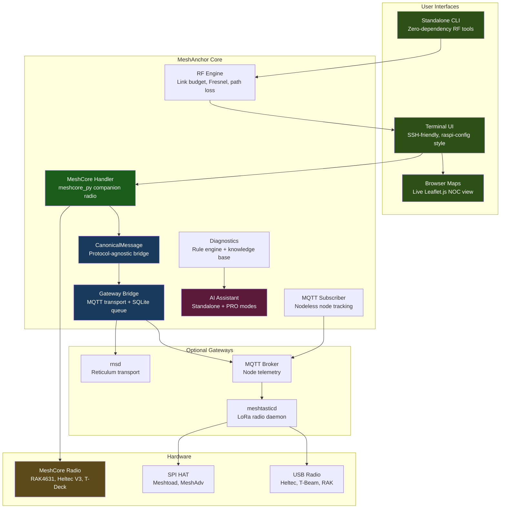
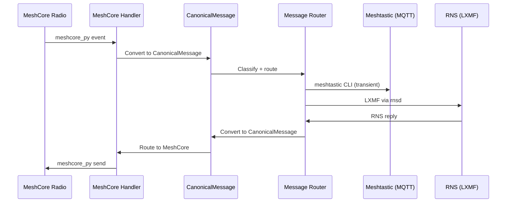

# MeshAnchor

<p align="center">
  <strong>MeshCore Network Operations Center</strong><br>
  <em>Anchor. Bridge. Monitor.</em>
</p>

<p align="center">
  <a href="https://github.com/Nursedude/meshanchor"></a>
  <a href="LICENSE"></a>
  <a href="https://python.org"></a>
  <a href="https://github.com/Nursedude/meshanchor"></a>
</p>

<p align="center">
  <a href="https://nursedude.substack.com">Development Blog</a> |
  <a href="https://github.com/Nursedude/meshanchor/issues">Report Issues</a> |
  <a href="#contributing">Contribute</a> |
  <a href="https://github.com/Nursedude/meshforge">Sister Project: MeshForge</a>
</p>

---

## What is MeshAnchor?

**MeshAnchor is a MeshCore-primary Network Operations Center** — the sister project to [MeshForge](https://github.com/Nursedude/meshforge).

Where MeshForge treats Meshtastic as the "home" radio, MeshAnchor flips the architecture: **MeshCore is primary, Meshtastic and RNS are optional gateways.** Same TUI framework. Same gateway bridge pattern. Same RF tools. Different home radio.

> **ALPHA SOFTWARE — Field validation has begun. We need your help testing.**
>
> MeshAnchor has **2,884 tests passing** against mocks. As of 2026-05-02 the
> first field deployment (Pi 4B + RAK Heltec V3 in Serial Companion mode) is
> running an end-to-end MeshCore stack: bidirectional channel messaging on
> Public + private channels via the daemon's chat API, daemon-managed gateway,
> RNS announce reception. Gateway-bridge end-to-end (MeshCore ↔ RNS LXMF
> delivery), coverage maps with live position data, and 3-way routing remain
> unvalidated. If you have a MeshCore companion radio (RAK4631, Heltec V3,
> T-Deck, T-Echo), your testing and feedback is the single most valuable
> contribution right now. See [Contributing](#contributing).

Plug in a MeshCore companion radio, run the installer, and you get:

- **MeshCore integration** — direct companion radio management via meshcore_py, pre-flight device validation, persistent udev naming
- **Gateway bridge** — bidirectional MeshCore to Meshtastic/RNS message routing via CanonicalMessage
- **RF engineering tools** — link budget, Fresnel zone, FSPL, coverage maps, space weather (NOAA)
- **TUI interface** — 65 handler commands, raspi-config style (whiptail/dialog), SSH-friendly
- **Live NOC maps** — Leaflet.js browser view with WebSocket updates
- **MQTT monitoring** — nodeless mesh observation, protobuf decode, traffic inspector
- **AI diagnostics** — offline knowledge base + optional Claude PRO mode
- **Prometheus/Grafana** — 50+ metrics, 5 pre-built dashboards

Optional add-ons (install from TUI when you need them):
- **NomadNet** — terminal-based LXMF client (Reticulum users)

### The Vision

MeshCore brings capabilities that Meshtastic can't — 64-hop routing (vs 7), flood-free mesh topology, and a protocol designed from the ground up for resilient long-range communication. But MeshCore lacks the operational tooling that network operators need: maps, monitoring, diagnostics, gateway bridging.

**MeshAnchor fills that gap.**

One interface to manage your MeshCore network. One gateway to bridge messages to Meshtastic and Reticulum nodes. One toolkit for RF planning, diagnostics, and field operations. All running on a Raspberry Pi that you can SSH into from anywhere.

This is the first open-source NOC that treats MeshCore as the primary radio, with Meshtastic and RNS as optional gateways rather than the other way around. No cloud dependencies. No subscriptions. Just a box that makes mesh networks work together.

```bash
sudo python3 src/launcher_tui/main.py
```

**Built for:** MeshCore developers, RF engineers, network operators, amateur radio operators, and emergency comms planners who want professional-grade network visibility.

---

## Quick Start

> **Using Meshtastic as your primary radio?** Use [MeshForge](https://github.com/Nursedude/meshforge) instead.

### Fresh Install

```bash
# One-liner (Pi / Debian / Ubuntu)
curl -sSL https://raw.githubusercontent.com/Nursedude/meshanchor/main/install.sh | sudo bash

# Or manually
git clone https://github.com/Nursedude/meshanchor.git /opt/meshanchor
cd /opt/meshanchor
sudo bash scripts/install_noc.sh    # Full NOC stack install
```

The NOC installer auto-detects your radio hardware (SPI HAT or USB), optionally installs
meshtasticd + Reticulum, and sets up systemd services. It will prompt you to select
your HAT if SPI is detected.

**One-liner options** (environment variables):
```bash
# Install with automatic system upgrade
curl -sSL https://raw.githubusercontent.com/Nursedude/meshanchor/main/install.sh | sudo UPGRADE_SYSTEM=yes bash

# Install without upgrade prompt
curl -sSL https://raw.githubusercontent.com/Nursedude/meshanchor/main/install.sh | sudo SKIP_UPGRADE=yes bash

# Use system pip instead of venv
curl -sSL https://raw.githubusercontent.com/Nursedude/meshanchor/main/install.sh | sudo BREAK_SYSTEM_PACKAGES=yes bash
```

**NOC installer options** (`scripts/install_noc.sh`):
```bash
sudo bash scripts/install_noc.sh --skip-meshtasticd   # Don't install meshtasticd
sudo bash scripts/install_noc.sh --skip-rns            # Don't install Reticulum
sudo bash scripts/install_noc.sh --client-only         # MeshAnchor only (no daemons)
sudo bash scripts/install_noc.sh --force-native        # Force SPI mode (native meshtasticd)
sudo bash scripts/install_noc.sh --force-python        # Force USB mode (Python CLI)
```

### Deployment Profiles

MeshAnchor supports 5 deployment profiles. Install only the dependencies you need:

| Profile | Primary Use | MeshCore | Meshtastic | RNS | MQTT |
|---------|------------|----------|------------|-----|------|
| `meshcore` (default) | MeshCore companion radio | Yes | -- | -- | -- |
| `radio_maps` | MeshCore + coverage mapping | Yes | -- | -- | -- |
| `monitor` | MQTT packet analysis | -- | -- | -- | Yes |
| `gateway` | MeshCore + Meshtastic/RNS bridge | Yes | Yes | Yes | Yes |
| `full` | Everything | Yes | Yes | Yes | Yes |

```bash
# Select profile at launch
python3 src/launcher.py --profile gateway

# Auto-detect (default): scans running services and installed packages
python3 src/launcher.py

# Profile is saved to ~/.config/meshanchor/deployment.json
```

### Already Have meshtasticd?

```bash
sudo python3 src/launcher_tui/main.py
```

### RF Tools Only (no sudo, no radio)

```bash
python3 src/standalone.py              # Interactive menu
python3 src/standalone.py rf           # RF calculator
python3 src/standalone.py sim          # Network simulator
python3 src/standalone.py --check      # Check dependencies
```

### TUI Menu Structure

The TUI uses a raspi-config style interface (whiptail/dialog) designed for SSH and
headless operation. Navigation is keyboard-driven with max 10 items per menu level:

```
Main Menu (MeshAnchor NOC)
├── 1. Dashboard             Service status, health, alerts, data path check
├── 2. Mesh Networks         MeshCore, Meshtastic, RNS, AREDN, MQTT, Gateway
│       └── MeshCore submenu Status, detect, config, nodes, stats, chat, daemon
│       └── RNS submenu      NomadNet Client (install/manage)
├── 3. RF & SDR              Link budget, site planner, frequency slots, SDR
├── 4. Maps & Viz            Live NOC map, coverage, topology, traffic inspector
├── 5. Configuration         Radio, channels, RNS config, services, backup
├── 6. System                Hardware detect, logs, network tools, shell, reboot
├── q. Quick Actions         Common shortcuts (2-tap access)
├── e. Emergency Mode        Field ops, weather/EAS alerts, SOS beacon
├── a. About                 Version, web client, help
└── x. Exit
```

### Upgrade / Reinstall / Uninstall

```bash
# Quick update (code + service files)
cd /opt/meshanchor && sudo bash scripts/update.sh

# Quick update to specific branch
sudo bash scripts/update.sh --branch main

# Clean reinstall (recommended for major version bumps)
sudo bash /opt/meshanchor/scripts/reinstall.sh

# Clean reinstall without confirmation prompt
sudo bash scripts/reinstall.sh --no-confirm

# Complete removal
sudo bash scripts/reinstall.sh --remove-only

# Manual git pull (developers)
cd /opt/meshanchor && sudo git pull origin main
```

**What is preserved during reinstall** (never touched):

| Preserved | Path | Why |
|-----------|------|-----|
| meshtasticd | apt package + `/etc/meshtasticd/config.yaml` | Separate package, your radio config |
| Radio hardware configs | `/etc/meshtasticd/config.d/` | Backed up and restored |
| Reticulum identity | `~/.reticulum/` | Your RNS address + keys |
| MeshAnchor user settings | `~/.config/meshanchor/` | Backed up and restored |
| MQTT broker | mosquitto service + config | Separate service |
| System packages | pip, apt installs | Not managed by MeshAnchor |

No need to re-image your Pi. Your radio stays configured.

### Post-Install Verification

```bash
# Automated check
sudo python3 src/launcher.py --verify-install

# Manual checks
python3 -c "from src.__version__ import __version__; print(__version__)"
python3 -m pytest tests/ -v --tb=short
sudo python3 src/launcher_tui/main.py
```

### Troubleshooting

| Issue | Solution |
|-------|----------|
| Python import errors | `sudo bash scripts/reinstall.sh` (clean reinstall) |
| `Local changes would be overwritten` | `git stash` before pull, or use clean reinstall |
| Service won't start | `journalctl -u meshanchor -n 50` |
| `meshcore` module not found | `pip install meshcore` (or `--break-system-packages` on Bookworm+) |
| USB device path changes on reboot | Install udev rules: `sudo cp scripts/99-meshcore.rules /etc/udev/rules.d/ && sudo udevadm control --reload-rules` |
| Permission denied on serial port | Add user to dialout group: `sudo usermod -aG dialout $USER` then log out/in |
| `meshtastic` module not found | `pip install meshtastic --break-system-packages --ignore-installed` |
| Config file conflicts | Restore from `~/meshanchor-backup-*` or regenerate via TUI |
| Stale `.pyc` files | Clean reinstall handles this automatically |

---

## What Works (v0.1.0-alpha)

### Status Definitions

| Status | Meaning |
|--------|---------|
| **Mock-Tested** | Passes unit tests against mocks. No field validation with real hardware. |
| **Inherited** | Carried from MeshForge where it was field-tested. Untested in MeshAnchor context. |
| **Code-Ready** | Implemented and compiles. Needs real hardware/services to validate. |

### MeshCore Integration (Code-Ready, MeshCore-only path Field-Validated 2026-05-02)

| Feature | Tests | Notes |
|---------|-------|-------|
| Companion radio detection | -- | Serial USB scan + udev persistent naming (`/dev/ttyMeshCore`) |
| Pre-flight device validation | -- | Serial probe before connection, permission + existence checks |
| meshcore_py connection | 602 | Async event loop, reconnect, message handling. **Field-validated** with RAK Heltec V3 in Serial Companion mode (2026-05-02). |
| CanonicalMessage bridging | 553 | Protocol-agnostic message format, N-protocol routing |
| 3-way routing classifier | 684 | MeshCore + Meshtastic + RNS tri-bridge tests (mock-only) |
| MeshCore TUI menu | -- | Status, detect, config, nodes, stats, chat, daemon control |
| Chat HTTP API (`/chat/*` on :8081) | 19 | Daemon-side ring buffer + send/receive endpoints. Bidirectional Public + private-channel messaging field-validated 2026-05-02. |
| Daemon control in TUI | 5 | start / stop / restart / journal / live tail through `service_check` SSOT |

### Gateway Bridge (Inherited + Code-Ready)

| Feature | Tests | Notes |
|---------|-------|-------|
| Meshtastic MQTT bridge | 140 | Zero-interference gateway (v0.5.4 architecture) |
| RNS/LXMF gateway | 97 | rnsd shared instance client |
| Message queue (SQLite) | 72 | Persistent queue, retry policy, circuit breaker |
| Reconnect engine | 45 | Exponential backoff (1s -> 30s max), jitter, slow start |
| MQTT robustness | 66 | Reconnection, message loss recovery, broker failover |

### RF & Maps (Inherited)

| Feature | Tests | Notes |
|---------|-------|-------|
| Link budget calculator | 107 | FSPL, Fresnel zone, earth bulge, signal classification |
| Coverage maps (Folium) | -- | Static HTML, SNR-based link coloring, offline tiles |
| Space weather (NOAA) | -- | Solar flux, K-index, band conditions |
| Site planner | -- | Range estimation with terrain |
| Cython fast path | -- | Optional 5-10x RF calculation speedup |

### TUI Interface (Inherited)

| Feature | Tests | Notes |
|---------|-------|-------|
| Handler registry | 70 | 65 handler files, Protocol + BaseHandler pattern |
| whiptail/dialog backend | -- | raspi-config style, SSH-friendly |
| Deployment profile selector | 31 | 5 profiles with auto-detection |
| Startup health checks | 20 | Service verification, conflict resolution |

### Monitoring & Telemetry (Inherited)

| Feature | Tests | Notes |
|---------|-------|-------|
| MQTT subscriber | 66 | Nodeless node tracking, protobuf decode |
| Traffic inspector | -- | Packet capture, protocol tree, display filters |
| RNS packet sniffer | -- | Wireshark-grade capture, announce tracking |
| Prometheus exporter | -- | 50+ metric families, Grafana-compatible |
| Node tracker | 68 | Unified node inventory, 15m offline threshold, 24h stale purge |

### Testing Reality Check

MeshAnchor has **2,884 automated tests** across 76 test files. However, automated tests
validate code paths with mocks — they do not replace field testing. Every feature
listed above needs validation with **real radios and real mesh traffic** before it can
be considered reliable.

**What has been validated with real hardware (first field deployment, 2026-05-02):**
- MeshCore companion radio connection (RAK Heltec V3, Serial Companion firmware via USB)
- Bidirectional channel messaging on Public (slot 0) and private channels (`meshanchor`
  on slot 1/2) — RX from a paired BLE Companion + iOS, TX from the daemon's chat API
  through the TUI, both directions confirmed
- Daemon stability under restart cycles (5 boot/restart-loop fixes landed during
  bring-up; full restart now produces a clean 5/5 services, no watchdog churn)
- Chat HTTP API + TUI Chat menu (since-id polling, channel + DM send paths)
- TUI daemon control (status / start / stop / restart / journal / live tail)
- RNS announce reception (gateway sees external `MeshForge Gateway (moc)` etc.)

**What has not yet been tested with real hardware in MeshAnchor:**
- Gateway bridge end-to-end message delivery (MeshCore → RNS LXMF and back)
- Coverage maps with real GPS position data
- Live NOC map with live node data
- 3-way routing (MeshCore <> Meshtastic <> RNS) with concurrent traffic

**What was field-tested in MeshForge** (inherited, likely works): TUI, meshtasticd config,
RF tools, RNS/rnsd integration, NomadNet, service management, standalone tools.

---

## Architecture



### Data Flow: MeshCore to Meshtastic/RNS



### Key Differences from MeshForge

| | MeshAnchor | MeshForge |
|---|---|---|
| Primary radio | MeshCore | Meshtastic |
| Default profile | `meshcore` | `radio_maps` |
| Bridge direction | MeshCore -> Meshtastic/RNS | Meshtastic -> MeshCore/RNS |
| meshtasticd required? | No (optional gateway) | Yes (primary) |
| meshcore package | Primary dependency | Optional |
| Python version | 3.10+ | 3.9+ |
| Field-tested | No (alpha) | Yes (beta) |

### Design Principles

- **TUI is a dispatcher** — selects what to run, not how to run it
- **Services run independently** — MeshAnchor connects, never embeds
- **Standard Linux tools** — `systemctl`, `journalctl`, `meshtastic`, `rnstatus`
- **Config overlays** — writes to `config.d/`, never overwrites defaults
- **Graceful degradation** — missing dependencies disable features, don't crash
- **Defense-in-depth** — handler registry dispatches with exception isolation per handler

---

## AI Intelligence

MeshAnchor includes two tiers of AI-powered network diagnostics:

### Standalone Mode (No Internet Required)
- 20+ topic knowledge base covering mesh networking fundamentals
- Rule-based diagnostic engine with pattern matching
- Structured troubleshooting guides for common issues
- Confidence scoring on diagnoses
- Works completely offline — ideal for field deployment

### PRO Mode (Claude API)
- Natural language troubleshooting ("Why is my MeshCore node offline?")
- Log file analysis with suggested actions
- Context-aware responses (knows your network topology)
- Predictive issue detection
- Falls back to Standalone when API unavailable

---

## Hardware

**Minimum:** Raspberry Pi 3B+ + MeshCore companion radio
**Recommended:** Raspberry Pi 4/5 + MeshCore radio (~$35-90)

| Component | Options |
|-----------|---------|
| **Computer** | Raspberry Pi 4/5 (recommended), Pi 3B+, Pi Zero 2W, x86_64 Linux |
| **OS** | Raspberry Pi OS Bookworm 64-bit, Debian 12+, Ubuntu 22.04+ |
| **MeshCore Radio** | See companion radios table below |
| **Optional** | Meshtastic radio (gateway), RTL-SDR (spectrum), GPS module |

### MeshCore Companion Radios

MeshCore companion radios connect via USB serial and are managed by the meshcore_py library.
MeshAnchor auto-detects connected devices.

| Device | Connection | Notes |
|--------|-----------|-------|
| **RAK4631** (nRF52840) | USB Serial | Ultra-low power, GPS, UF2 flashing |
| **Heltec V3** (ESP32-S3) | USB Serial / WiFi TCP | Common, affordable, gateway capable |
| **Heltec V4** (ESP32-S3) | USB Serial | 28dBm TX power |
| **T-Deck** | USB Serial | Built-in keyboard + display |
| **T-Echo** | USB Serial | E-ink display, GPS |
| **Station G2** | USB Serial | Gateway capable, PoE option |

### Meshtastic Gateway Radios (Optional)

For the `gateway` or `full` deployment profile, you also need a Meshtastic radio.
MeshAnchor supports all radios that MeshForge supports — see the
[MeshForge hardware tables](https://github.com/Nursedude/meshforge#hardware) for
SPI HATs (MeshAdv, Waveshare, Ebyte, RAK) and USB radios (Heltec, T-Beam, MeshToad).

Pre-built gateway profiles are available in `src/gateway/profiles/`:

| Profile | Radio | Use Case |
|---------|-------|----------|
| `heltec_v3_gateway.yaml` | Heltec V3 | Standard USB gateway |
| `heltec_v4_gateway.yaml` | Heltec V4 | High-power USB gateway |
| `rak4631_gateway.yaml` | RAK4631 | Low-power gateway |
| `station_g2_gateway.yaml` | Station G2 | Infrastructure gateway |
| `rnode_gateway.yaml` | RNode | Dedicated RNS radio |

---

## Project History

MeshAnchor shares 2,848 commits of history with MeshForge. Here's how we got here:

### Origins (December 2025)

The project started as **"Meshtasticd Interactive UI"** — a simple interactive installer
and manager for meshtasticd on Raspberry Pi. Initial commit: 2025-12-27.

### MeshForge Era (January - March 2026)

The installer rapidly evolved into a full Network Operations Center:

| Version | Date | Milestone |
|---------|------|-----------|
| v0.4.0-beta | 2026-01-10 | Initial public release — GTK4 desktop + Meshtastic-RNS gateway |
| v0.4.1-beta | 2026-01-12 | TUI interface added (raspi-config style) |
| v0.4.2-beta | 2026-01-13 | RF tools — FSPL, Fresnel zone, link budget |
| v0.4.6-beta | 2026-01-17 | AI diagnostics, coverage maps, CI/CD |
| v0.4.7-beta | 2026-01-17 | Regression prevention system, predictive analytics |
| v0.5.0-beta | 2026-02-01 | Beta milestone — TUI stable across 6+ fresh installs |
| v0.5.1-beta | 2026-02-06 | Telemetry pipeline, RNS sniffer, Path.home() security fixes |
| v0.5.3-beta | 2026-02-08 | 350+ unit tests for core gateway bridge |
| v0.5.4-beta | 2026-02-11 | MQTT bridge architecture (zero interference with web client) |
| v0.5.5-beta | 2026-03-09 | MeshChat removed, mesh alert engine, focus narrowed |

During this period, MeshCore support was explored on an alpha branch with a 796-line
`meshcore_handler.py`, a `CanonicalMessage` protocol format for N-protocol bridging,
and 1,839 tests for tri-bridge routing.

### The Split (April 1, 2026)

MeshAnchor was **extracted from MeshForge main** at commit `7e4fa02`. The extraction:

- Rebranded 580+ references from MeshForge to MeshAnchor
- Renamed all service/config files (`meshforge.service` -> `meshanchor.service`)
- Created `RadioMode` abstraction (`src/core/radio_mode.py`)
- **Inverted the architecture**: MeshCore enabled by default, Meshtastic optional
- Inverted deployment profiles: `meshcore` is the default (was `radio_maps`)
- Removed 16 Meshtastic-specific source files and 8 Meshtastic-specific test files
- Gated remaining Meshtastic imports as optional gateway support
- Updated CI for Python 3.10+, meshcore package
- Version reset to **0.1.0-alpha**

### Today

Two sister projects with the same DNA, different home radios:

```
MeshForge (v0.5.5-beta)           MeshAnchor (v0.1.0-alpha)
  Primary: Meshtastic               Primary: MeshCore
  Gateway to: MeshCore/RNS          Gateway to: Meshtastic/RNS
  Field-tested: Yes                  Field-tested: No — needs YOU
```

---

## Ecosystem

MeshAnchor is part of a 5-repository ecosystem:

| Repository | Purpose | Version |
|------------|---------|---------|
| **[meshanchor](https://github.com/Nursedude/meshanchor)** (this repo) | MeshCore-primary NOC — gateway, TUI, RF tools, diagnostics | 0.1.0-alpha |
| **[meshforge](https://github.com/Nursedude/meshforge)** | Meshtastic-primary NOC — same architecture, different home radio | 0.5.5-beta |
| **meshanchor-maps** | Visualization plugin — Leaflet/D3.js topology, health scoring | 0.7.0 |
| **meshing_around_meshanchor** | Bot alerting — 12 alert types, complements meshing-around bot | 0.5.0 |
| **[RNS-Management-Tool](https://github.com/Nursedude/RNS-Management-Tool)** | Cross-platform RNS ecosystem installer | 0.3.2 |

### Shared Components

Both MeshForge and MeshAnchor share these core components. Changes to the shared
contract must stay compatible across both projects:

- **CanonicalMessage** (`src/gateway/canonical_message.py`) — the protocol-agnostic
  message format that bridges all three radio protocols
- **TUI handler architecture** — Protocol + BaseHandler + HandlerRegistry dispatch
- **RF tools** (`src/utils/rf.py`) — link budget, Fresnel, FSPL, coverage maps
- **Gateway bridge pattern** — adapter -> CanonicalMessage -> message router

### Which Should You Run?

- **MeshForge** — if Meshtastic is your primary radio
- **MeshAnchor** — if MeshCore is your primary radio
- **Both** — if you operate both radio types on separate Pis

---

## Project Structure

```
src/
├── launcher_tui/          # PRIMARY INTERFACE (TUI)
│   ├── main.py            # NOC launcher + handler registration
│   ├── handler_protocol.py  # CommandHandler Protocol + TUIContext + BaseHandler
│   ├── handler_registry.py  # register/lookup/dispatch
│   ├── backend.py           # whiptail/dialog abstraction
│   ├── startup_checks.py   # Environment checks + conflict resolution
│   ├── status_bar.py       # Service status bar
│   └── handlers/            # 65 registered command handlers
├── gateway/               # Multi-protocol bridge engine
│   ├── meshcore_handler.py   # MeshCore companion radio (meshcore_py) — PRIMARY
│   ├── rns_bridge.py        # RNS/LXMF gateway (optional)
│   ├── mqtt_bridge_handler.py # Meshtastic MQTT bridge (optional)
│   ├── canonical_message.py  # Protocol-agnostic message format
│   ├── message_routing.py   # 3-way routing classifier
│   ├── message_queue.py     # SQLite persistent queue
│   ├── circuit_breaker.py   # Fault tolerance
│   └── profiles/            # 5 gateway radio profiles (Heltec, RAK, RNode, Station G2)
├── monitoring/            # Network monitoring
│   ├── mqtt_subscriber.py   # Nodeless MQTT node tracking
│   ├── traffic_inspector.py # Packet capture + protocol analysis
│   ├── rns_sniffer.py      # RNS packet capture + announce tracking
│   └── path_visualizer.py  # Multi-hop path tracing
├── commands/              # Command modules (propagation, hamclock, service mgmt)
├── utils/                 # Core utilities
│   ├── rf.py              # RF calculations (haversine, FSPL, Fresnel, link budget)
│   ├── coverage_map.py    # Folium map generator + offline tile cache
│   ├── service_check.py   # Service management (single source of truth)
│   ├── diagnostic_engine.py # Rule-based diagnostics
│   ├── claude_assistant.py  # AI assistant (Standalone + PRO)
│   ├── prometheus_exporter.py # Metrics pipeline
│   └── paths.py           # Sudo-safe path resolution
├── tactical/              # Tactical operations, QR transport, compliance
├── core/                  # RadioMode, orchestrator, plugin system
├── standalone.py          # Zero-dependency RF tools
└── __version__.py         # Version: 0.1.0-alpha

scripts/
├── install_noc.sh         # Full NOC stack installer
├── update.sh              # In-place code update
├── reinstall.sh           # Clean reinstall (preserves config)
├── lint.py                # Security linter (11 rules: MF001-MF011)
├── meshanchor-launcher.sh # Shell wrapper
└── verify_post_install.sh # Post-install health check

dashboards/                # 5 Grafana monitoring dashboards
├── meshanchor-overview.json  # Health, services, queues
├── meshanchor-nodes.json     # Per-node RF metrics
├── meshanchor-gateway.json   # Gateway bridge status
├── meshanchor-infinity.json  # Long-term trends
└── meshanchor-influxdb.json  # InfluxDB integration

templates/                 # Config templates (meshtasticd, reticulum, MQTT, systemd)
config_templates/          # RNS gateway configuration templates
tests/                     # 81 test files, 2,729 tests
docs/                      # REST API, metrics, usage guide, visual guide
examples/                  # Example configurations
web/                       # Node map, LOS visualization (browser)
```

---

## Configuration

### meshtasticd (Optional — Gateway Profile Only)

MeshAnchor writes hardware config overlays (never overwrites defaults):

```
/etc/meshtasticd/
├── config.yaml                    # Package default (DO NOT EDIT)
└── config.d/
    ├── lora-*.yaml                # Hardware config (SPI pins, module)
    └── meshanchor-overrides.yaml  # Custom overrides
```

LoRa modem presets and frequency slots are applied via the meshtastic
CLI (`--set lora.modem_preset`, `--set lora.channel_num`), not config.d.

### Reticulum

Auto-deploys a working config from `templates/reticulum.conf`:
- AutoInterface (LAN discovery)
- Meshtastic Interface on `127.0.0.1:4403` (if gateway profile)
- RNode LoRa (optional, for dedicated RNS radio)

Gateway-specific templates in `config_templates/`:
- `rns_meshtastic_gateway.conf` — full gateway with Meshtastic interface
- `rns_minimal.conf` — minimal config for MeshCore-only operation

### Ports

| Port | Service | Owner | Notes |
|------|---------|-------|-------|
| 4403 | meshtasticd TCP API | meshtasticd | Optional (gateway only), single client limit |
| 9443 | meshtasticd Web UI | meshtasticd | Optional (gateway only) |
| 1883 | MQTT broker | mosquitto | Optional, multi-consumer |
| 5000 | Map Server | **MeshAnchor** | Live NOC map + REST API |
| 5001 | WebSocket | **MeshAnchor** | Real-time message broadcast |
| 8081 | Config API | **MeshAnchor** | RESTful config management |
| 9090 | Prometheus metrics | **MeshAnchor** | Grafana-compatible JSON API |

---

## Code Health

### Test Coverage

**2,729 tests** across 75 test files:

| Test File | Tests | Covers |
|-----------|-------|--------|
| `test_tribridge_integration.py` | 684 | MeshCore <> Meshtastic <> RNS 3-way routing |
| `test_meshcore_handler.py` | 602 | MeshCore connection, messaging, node tracking |
| `test_canonical_message.py` | 553 | CanonicalMessage format, protocol conversion |
| `test_rns_bridge.py` | 140 | Core bridge: routing, circuit breaker, callbacks |
| `test_rf.py` | 107 | RF calculations: haversine, FSPL, Fresnel, link budget |
| `test_rns_transport.py` | 97 | Packet fragmentation, reassembly, transport stats |
| `test_meshtastic_protobuf.py` | 74 | Protobuf HTTP client, device config |
| `test_message_queue.py` | 72 | SQLite queue, retry policy, dead letter |
| `test_status_bar.py` | 70 | TUI status bar rendering |
| `test_node_tracker.py` | 68 | Unified node tracking |
| `test_mqtt_robustness.py` | 66 | MQTT reconnection, broker failover |
| `test_commands.py` | 61 | CLI command handlers |

*All tests use mocked external services. Field validation with real hardware is a separate track — and the one that needs your help.*

```bash
python3 -m pytest tests/ -v            # Run all tests
python3 -m pytest tests/ -v -x         # Stop on first failure
python3 -m pytest tests/test_meshcore_handler.py -v  # MeshCore tests only
```

### Auto-Review & Lint

Security linter (`scripts/lint.py`) enforces 11 rules:

| Rule | Description |
|------|-------------|
| MF001 | `Path.home()` -> use `get_real_user_home()` for sudo safety |
| MF002 | No `shell=True` in subprocess calls |
| MF003 | No bare `except:` — specify exception types |
| MF004 | All subprocess calls need `timeout` parameter |
| MF006 | No `safe_import` for first-party modules — use direct imports |
| MF007 | No direct `TCPInterface()` — use connection manager |
| MF008 | No raw `systemctl` for service state — use `service_check` |
| MF009 | `RNS.Reticulum()` must include `configdir=` parameter |
| MF010 | No `time.sleep()` in daemon loops — use `_stop_event.wait()` |
| MF011 | RNS repair logic must live in `_rns_repair.py` / diagnostics |

```bash
python3 scripts/lint.py --all          # Run all lint rules
git config core.hooksPath .githooks    # Enable pre-commit hooks
```

### Reliability Patterns

- **Circuit breaker** — fault isolation on gateway connections
- **Exponential backoff** — reconnect (1s -> 2s -> 4s -> ... -> 30s max) with jitter
- **Graceful degradation** — `safe_import` for optional dependencies, features disable not crash
- **Handler isolation** — registry dispatch with per-handler exception boundaries
- **Persistent queue** — SQLite message queue survives restarts
- **Shared connection manager** — prevents TCP:4403 client contention
- **Pre-flight validation** — device probes before connection, service checks before operations
- **Stale node purge** — 24h TTL on offline nodes, prevents ghost entries in node tracker
- **Localhost-only control** — all mutating HTTP endpoints restricted to loopback
- **Permission hardening** — narrow Bash subcommand patterns with explicit deny list (CVE-2026-21852)

---

## Contributing

> **The #1 way to help right now: test MeshAnchor with a real MeshCore radio and report what happens.**

### How to Help (Priority Order)

1. **Test with real MeshCore hardware** — connect a companion radio, try the TUI,
   attempt gateway bridging, report results. This is the single most impactful
   contribution you can make.

2. **Report issues** — field test results (even "it worked!" is valuable), bugs,
   unexpected behavior, missing documentation. Use
   [GitHub Issues](https://github.com/Nursedude/meshanchor/issues).

3. **Code contributions** — feature branches use `claude/` prefix, merged via PR to main.

### Development Commands

```bash
python3 -m pytest tests/ -v           # Run tests
python3 scripts/lint.py --all         # Security linter
git config core.hooksPath .githooks   # Enable pre-commit hooks
```

**Code rules:** No `shell=True`, no bare `except:`, use `get_real_user_home()` not
`Path.home()`, use `_stop_event.wait()` not `time.sleep()` in daemon loops,
split files over 1,500 lines.

**Commit style:** `feat:`, `fix:`, `docs:`, `refactor:`, `test:`, `security:`

See [CLAUDE.md](CLAUDE.md) for the complete development guide.

---

## Development

### Branch Strategy

| Branch | Version | Focus |
|--------|---------|-------|
| `main` | `0.1.0-alpha` | MeshCore-primary NOC, alpha testing |

**Sister project:** [MeshForge](https://github.com/Nursedude/meshforge) is the
Meshtastic-primary NOC — extracted from the same codebase on 2026-04-01.

Feature branches use `claude/` prefix, merged via PR to main.

**Shared contract:** `CanonicalMessage` in `src/gateway/canonical_message.py` must
stay compatible with MeshForge's version. Changes to the message format should be
coordinated across both projects.

---

## Research & Technical Foundation

MeshAnchor development is backed by 22+ technical research documents covering
protocol analysis, integration architecture, and RF engineering. These inform
every major design decision in the codebase.

### Multi-Protocol Bridging
- MeshCore <> Meshtastic dual-protocol bridge architecture (3-way routing design)
- MeshCore reliability patterns: canonical packet format, MQTT origin filtering, lenient parsing
- Gateway scenario analysis: multi-protocol deployment topologies and trade-offs

### RF & Physical Layer
- LoRa PHY deep-dive: CSS modulation, spreading factors, SNR limits, link budget calculations
- Official Semtech LoRa reference data for engineering-grade RF planning

### Protocol Documentation
- Complete Reticulum/RNS protocol documentation, configuration guides, and integration patterns
- AREDN mesh network integration research

### Tactical Operations
- XTOC/XCOM integration: X1 compact packet protocol, structured message templates
- ATAK ecosystem research: CoT XML, PLI, GeoChat, KML/CoT export

### Architecture & Infrastructure
- MQTT zero-interference bridging design (foundation of the gateway architecture)
- NGINX reliability patterns applied to mesh networking APIs

Full research library: [`.claude/research/`](.claude/research/README.md)

---

## Resources

| Resource | Link | Relation |
|----------|------|----------|
| MeshCore | [meshcore.co](https://meshcore.co/) | Primary radio protocol |
| Meshtastic | [meshtastic.org/docs](https://meshtastic.org/docs/) | Optional gateway radio |
| Reticulum | [reticulum.network](https://reticulum.network/) | Optional gateway (encrypted transport) |
| MeshForge | [github.com/Nursedude/meshforge](https://github.com/Nursedude/meshforge) | Sister project (Meshtastic-primary) |
| Development Blog | [nursedude.substack.com](https://nursedude.substack.com) | Project updates |

---

## License

GPL-3.0 — See [LICENSE](LICENSE)

---

<p align="center">
  <strong>MeshAnchor</strong><br>
  <em>Made with aloha for the mesh community</em><br>
  WH6GXZ | Hawaii
</p>
