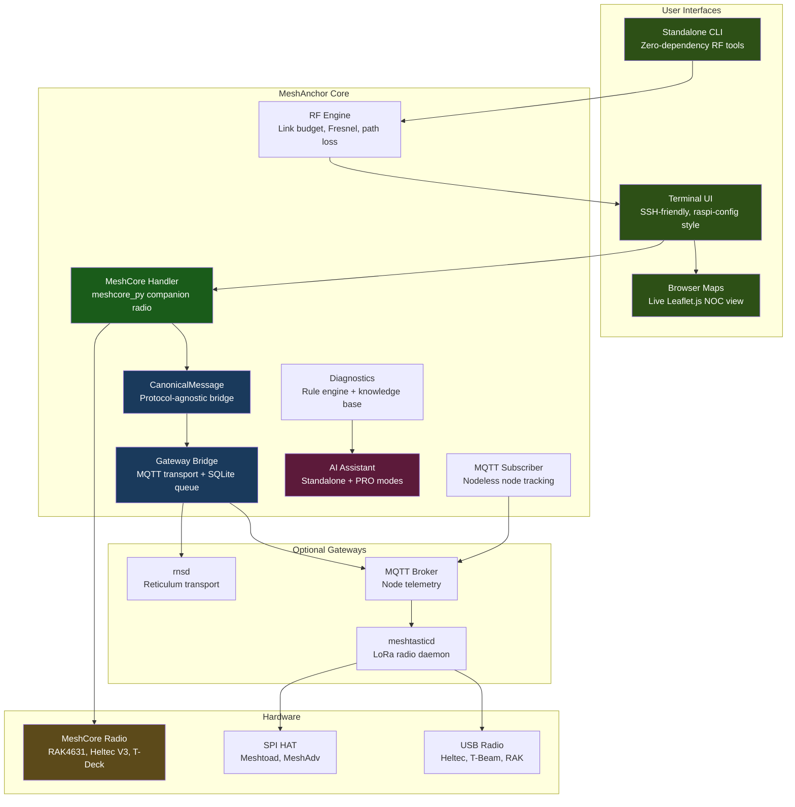
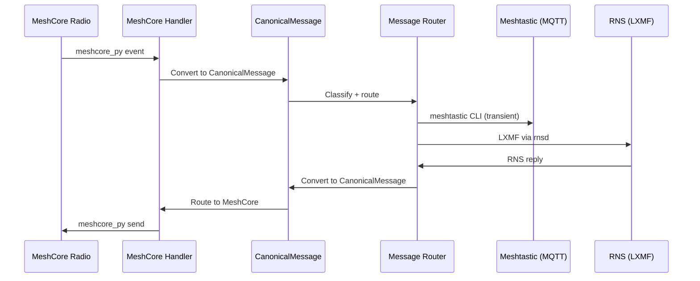

# Architecture

How the pieces fit, and where the code lives.

## Architecture



### Data Flow: MeshCore to Meshtastic/RNS



### Key Differences from MeshForge

| | MeshAnchor | MeshForge |
|---|---|---|
| Primary radio | MeshCore | Meshtastic |
| Default profile | `meshcore` | `radio_maps` |
| Bridge direction | MeshCore -> Meshtastic/RNS | Meshtastic -> MeshCore/RNS |
| meshtasticd required? | No (optional gateway) | Yes (primary) |
| meshcore package | Primary dependency | Optional |
| Python version | 3.10+ | 3.9+ |
| Field-tested | Continuous deployment on `meshanchor-server` since 2026-05-02; 24h clean fleet soak 2026-05-11; LXMF bridge cross-federation 2026-05-09 | Yes (beta) |

### Design Principles

- **TUI is a dispatcher** — selects what to run, not how to run it
- **Services run independently** — MeshAnchor connects, never embeds
- **Standard Linux tools** — `systemctl`, `journalctl`, `meshtastic`, `rnstatus`
- **Config overlays** — writes to `config.d/`, never overwrites defaults
- **Graceful degradation** — missing dependencies disable features, don't crash
- **Defense-in-depth** — handler registry dispatches with exception isolation per handler

---

## Project Structure

```
src/
├── launcher_tui/          # PRIMARY INTERFACE (TUI)
│   ├── main.py            # NOC launcher + handler registration
│   ├── handler_protocol.py  # CommandHandler Protocol + TUIContext + BaseHandler
│   ├── handler_registry.py  # register/lookup/dispatch
│   ├── backend.py           # whiptail/dialog abstraction
│   ├── startup_checks.py   # Environment checks + conflict resolution
│   ├── status_bar.py       # Service status bar
│   └── handlers/            # 85 registered command handlers
├── daemon.py              # MeshCore radio daemon (chat API + /radio endpoints on :8081)
├── gateway/               # Multi-protocol bridge engine
│   ├── meshcore_handler.py   # MeshCore companion radio (meshcore_py) — PRIMARY
│   ├── rns_bridge.py        # RNS/LXMF gateway (optional)
│   ├── mqtt_bridge_handler.py # Meshtastic MQTT bridge (optional)
│   ├── canonical_message.py  # Protocol-agnostic message format
│   ├── message_routing.py   # 3-way routing classifier
│   ├── message_queue.py     # SQLite persistent queue
│   ├── circuit_breaker.py   # Fault tolerance
│   └── profiles/            # 5 gateway radio profiles (Heltec, RAK, RNode, Station G2)
├── monitoring/            # Network monitoring
│   ├── mqtt_subscriber.py   # Nodeless MQTT node tracking
│   ├── traffic_inspector.py # Packet capture + protocol analysis
│   ├── rns_sniffer.py      # RNS packet capture + announce tracking
│   └── path_visualizer.py  # Multi-hop path tracing
├── commands/              # Command modules (propagation, hamclock, service mgmt)
├── utils/                 # Core utilities
│   ├── rf.py              # RF calculations (haversine, FSPL, Fresnel, link budget)
│   ├── coverage_map.py    # Folium map generator + offline tile cache
│   ├── service_check.py   # Service management (single source of truth)
│   ├── diagnostic_engine.py # Rule-based diagnostics
│   ├── claude_assistant.py  # AI assistant (Standalone + PRO)
│   ├── prometheus_exporter.py # Metrics pipeline
│   ├── active_health_probe.py # Health probes (RNS wedge, delivery stall, drift checks)
│   ├── rns_init.py        # Guarded RNS chokepoint (shared with MeshForge, fork-pinned)
│   └── paths.py           # Sudo-safe path resolution
├── tactical/              # Tactical operations, QR transport, compliance
├── core/                  # RadioMode, orchestrator, plugin system
├── standalone.py          # Zero-dependency RF tools
└── __version__.py         # Version SSOT + changelog

scripts/
├── install_noc.sh         # Full NOC stack installer
├── update.sh              # In-place code update
├── reinstall.sh           # Clean reinstall (preserves config)
├── lint.py                # Security linter (17 rules: MF001-MF014, MF016, MA017, MF019-MF020)
├── meshanchor-launcher.sh # Shell wrapper
└── verify_post_install.sh # Post-install health check

dashboards/                # 5 Grafana monitoring dashboards
├── meshanchor-overview.json  # Health, services, queues
├── meshanchor-nodes.json     # Per-node RF metrics
├── meshanchor-gateway.json   # Gateway bridge status
├── meshanchor-infinity.json  # Long-term trends
└── meshanchor-influxdb.json  # InfluxDB integration

templates/                 # Config templates (meshtasticd, reticulum, MQTT, systemd)
config_templates/          # RNS gateway configuration templates
tests/                     # <!--STAT:testfiles-->217<!--/STAT--> test files, ~5,900 tests
docs/                      # REST API, metrics, usage guide, visual guide
examples/                  # Example configurations
web/                       # Node map, LOS visualization (browser)
```

---

